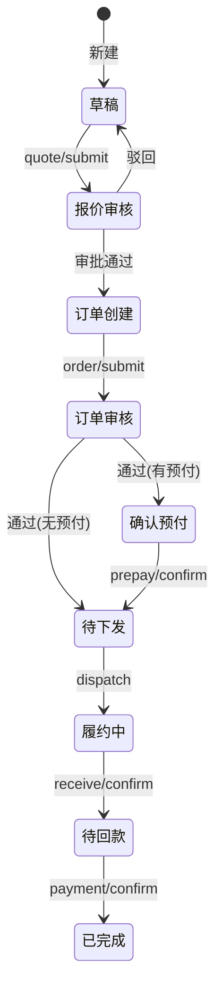

# 分销订单（distribution_order）前端接口说明

> 路径前缀：`/distribution_order/`（主仓挂载方式以实际环境为准）。  
> 鉴权：OAuth2 Bearer Token（与其它系统模块一致）。  
> HTTP 状态码一般为 200；业务成败看响应体 `code`。

---

## 1. 通用约定

### 1.1 响应结构

```json
{
  "code": 200,
  "msg": "success",
  "data": {}
}
```

| code | 含义 |
|------|------|
| 200 | 成功 |
| 40000 | 业务失败（状态不允许、校验失败等） |

- **GET 列表/详情**：`status_str`、`tags_str` 等文案字段可走 `@translate_all_output` 多语言。
- **POST 写接口**：`msg` 按请求语言翻译；不要对已由装饰器翻译的 GET 响应再手动翻 `msg`。

### 1.2 主键字段

- 库表主键列名为 `_id`；JSON 中统一用 **`_id`**（部分写接口成功时额外带 `id`，与 `_id` 同值）。
- Pydantic 入参若文档写 `id`，实际 body 请传 **`_id`**（`allow_population_by_field_name`）。

### 1.3 多选筛选（Query）

以下参数类型为 **JSON 字符串**，默认 `"[]"`，解析失败返回 `40000`：

`status`、`offline_customer_ids`、`customer_country`、`customer_type`、`shop_id`、`tags`、`is_prepayment`、`settlement_method`

示例：`status=[10,20]` → 传 `status="[10,20]"`。

### 1.4 明细行增删改（报价/订单共用）

**主流程**：在 `draft/save` 的 `quote_details`、或 `order/save` 的 `order_details` 数组里一并提交（见 §3.2、§5.1、§5.2）。独立 `quote_details/save`、`order_details/save` 可不接。

在明细数组中：

| 场景 | 传参 |
|------|------|
| 新增 | 不传 `_id` |
| 更新 | 传 `_id`，`is_delete=0`（可省略，默认 0） |
| 软删 | 传 `_id`，`is_delete=1` |

- 同单未删除行 **SKU 不可重复**（含本次 body 多行互斥）。
- 兼容旧版：`deleted_quote_detail_ids` / `deleted_order_detail_ids` 仍可用，推荐改用行内 `is_delete=1`。

### 1.5 附件 JSON

`customer_po_attachments`、`ship_guide_attachments`、`attachments`（水单）等为 **对象或数组**，空传 `null` 或不传；不要传字符串 `"null"`。

---

## 2. 订单状态与按钮

### 2.1 主状态 `status`

| 值 | 文案 `status_str` | 说明 |
|----|-------------------|------|
| 10 | 草稿 | 报价阶段编辑 |
| 20 | 报价审核 | 定价审批链 |
| 30 | 订单创建 | 录入订单明细、物流等 |
| 40 | 订单审核 | 标准/大额审批链 |
| 50 | 确认预付 | 有预付时进入 |
| 60 | 待下发 | 可下发千易、拆单 |
| 70 | 履约中 | 确认实收 |
| 80 | 待回款 | 确认尾款 |
| 90 | 已完成 | |
| 99 | 已作废 | |

### 2.2 列表/详情 `button_list`（value）

| value | 含义 | 常见出现状态 |
|-------|------|----------------|
| `quote_submit` | 提交报价审核 | 10 |
| `quote_review` | 进入报价审核 | 20 |
| `quote_withdraw` | 撤回报价审核 | 20 |
| `order_submit` | 提交订单审核 | 30 |
| `order_review` | 进入订单审核 | 40 |
| `order_withdraw` | 撤回订单审核 | 40 |
| `prepay_confirm` | 确认预付 | 50 |
| `dispatch` | 下发千易 | 60 |
| `split` | 拆单 | 60 |
| `receive_confirm` | 确认实收 | 70 |
| `payment_confirm` | 确认回款 | 80 |
| `edit` | 编辑 | 10、30 |
| `select` | 详情 | 多数状态 |
| `terminate` | 作废 | 10、30 |
| `log` | 操作记录 | 多数状态 |

详情额外字段：

- `has_approve_permission`：当前用户是否可审当前环节。
- `reject_to_info`：驳回目标选项（报价/订单审核中），元素含 `to_step_no`、`to_status`、`operator_role` 等。

### 2.3 标签 `tags`（筛选与展示）

筛选 Query `tags`：传 **bit 值** 数组 JSON，如 `"[1,8]"`，多选 **OR**。

| bit | `tags_str` |
|-----|------------|
| 1 | 价偏 |
| 2 | 大额 |
| 4 | 样品 |
| 8 | 缺货 |
| 16 | 拆单 |
| 32 | 特殊作业 |
| 64 | 紧急 |
| 128 | 实收差异 |
| 256 | 回款超期 |
| 512 | 待传水单 |

回显：`tags`（bit 数组）、`tags_str`（中文）、`tags_bitmask`（位图整数）。

### 2.4 其它常用编码

| 字段 | 值 | 含义 |
|------|-----|------|
| `settlement_method` | 1 | 带款提货 |
| | 2 | 账期 |
| `delivery_fee_payment` / `contract_delivery_fee_payment` | 1 | Simplus Pay |
| | 2 | Customer Pay |
| `delivery_method`（快照） | 1 | 指定地点 |
| | 2 | 配送中心 |
| | 3 | 自提 |
| `sample_policy`（快照） | 1 | 免费 |
| | 2 | 折扣 |
| `is_prepayment` | 0/1 | 无预付 / 有预付 |
| `is_tax_free` / `is_ewt` | 0/1 | 否 / 是 |
| `is_protocol_sample`（订单明细） | 0/1 | 否 / 是 |
| `current_chain_code` | 1 | 定价审批（报价） |
| | 2 | 订单审批-标准 |
| | 3 | 订单审批-大额 |

---

## 3. 接口一览

### 3.1 主单

#### GET `/distribution_order/list/` — 列表

**Query**

| 参数 | 类型 | 说明 |
|------|------|------|
| `page` | int | 默认 1 |
| `page_size` | int | 默认 50，最大 200 |
| `keyword` | string | 模糊：单号、客户编码、简称 |
| `customer_name_code` | string | 客户编码/简称 |
| `status` | JSON 字符串 | 主状态多选 |
| `offline_customer_ids` | JSON 字符串 | 客户 id |
| `customer_country` | JSON 字符串 | 国家 |
| `customer_type` | JSON 字符串 | 客户类型 |
| `shop_id` | JSON 字符串 | 店铺 |
| `tags` | JSON 字符串 | 标签 bit |
| `is_prepayment` | JSON 字符串 | 0/1 |
| `settlement_method` | JSON 字符串 | 1/2 |
| `execute_user_ids` | JSON 字符串 | 当前执行人 user_id 多选，如 `[154,201]` |
| `batch_id` | string | 批次号精确匹配 |
| `is_download` | int | 1=导出（当前未实现） |
| `is_show_config` | int | 1=仅返回表头配置，不查列表 |

**data 结构**

```json
{
  "t_data": [ /* 行对象，见 §4.1 */ ],
  "page": 1,
  "page_size": 50,
  "total": 100,
  "page_total": 2,
  /* 以及表头配置字段（filter_value、columns 等，来自 table mapping） */
}
```

#### GET `/distribution_order/meta/execute_users/` — 当前执行人筛选项

与列表 `execute_user_ids` 同口径：收集在途单（`status<=40`）上的创建人、直线上级、当前环节角色审批人。

| 参数 | 说明 |
|------|------|
| `keyword` | 可选，按姓名/id 模糊 |

**data**：`[{ "label": "朱亚明", "value": 1882 }, ...]`

#### GET `/distribution_order/detail/` — 详情

| 参数 | 说明 |
|------|------|
| `order_id` | 主单 `_id`，必填 |
| `is_show_config` | 1=仅表头配置 |

**data**：表头配置 + **`tData`: `[ 单条详情对象 ]`**（注意驼峰 `tData`）。  
详情对象 = §4.1 主单字段 + §4.2 快照 + §4.3 明细 + §4.4 履约 + §4.5 审批流 + 扩展字段（`button_list`、`reject_to_info`、`sales_user_name` 等）。

#### POST `/distribution_order/draft/save/` — 草稿/报价阶段保存

**Body**：`DistributionOrderDraftIn`（字段全集见 §5.1、§4.1、§4.2）。  
**可编辑状态**：主单 `status=10`（草稿）。  
**成功 data**：`{ "_id": 123, "id": 123 }`（`id` 与 `_id` 同值）。

**必填（后端校验）**

| 场景 | 必传字段 |
|------|----------|
| **新建**（首次保存） | `offline_customer_id`（>0）。**勿传** `_id` 或传 `null`。 |
| **更新**（已有单） | `_id`（订单主键，>0）。 |

新建时若 body 未带 `customer_country`，后端会从客户主数据补全；仍补不出则报「客户国家为空，无法生成单号」。

**报价明细 `quote_details`（与主表同请求，见 §1.4）**

- **可不传**或传 `[]`：只改主表/快照、不动已有报价行。
- **要增删改行**：传 `quote_details` 数组；**常规流程不必再调** §3.2 的 `quote_details/save/`、`delete/`。

| 行操作 | 必传（行内） | 建议一并传（前端算好金额） |
|--------|----------------|---------------------------|
| 新增行 | `sku`（非空） | `price_with_vat` / `price_without_vat`、`qty`、行金额字段、库存快照等（与详情展示一致） |
| 更新行 | `_id` | 仅传本次要改的字段（未传字段保持库中原值） |
| 软删行 | `_id`、`is_delete`: 1 | — |

- 同单未删除行 **SKU 不可重复**（含本 body 多行）。
- 兼容：`deleted_quote_detail_ids` 仍可传 id 列表软删；推荐行内 `is_delete=1`。

**主表 / 快照（§4.1、§4.2）**

- Pydantic 层均为可选；**更新时只传有改动的字段**（未出现在 body 的键不覆盖库值）。
- **主表热字段与扩展快照均以 body 为准**，后端不从客户/合同主数据自动补全或覆盖；换客户/换合同时请前端把 `contract_id`、客户快照、合同快照等一并传入。
- 新建后常见需逐步补齐：`contract_id`、`shop_id`、`sales_user_id`、`currency`、`is_tax_free`、`vat_rate`、`remark` 及联系人/地址/合同快照等；**提交报价审核**时的额外必填以表头配置 `validation_fields_quote` 为准（见 `quote/submit`），与 save 接口分离。

**新建示例（最小）**

```json
{
  "offline_customer_id": 1001,
  "quote_details": [
    {
      "sku": "SKU001",
      "qty": 10,
      "price_with_vat": "100.00",
      "price_without_vat": "90.00",
      "amount_with_vat": "1000.00",
      "amount_without_vat": "900.00",
      "vat_amount": "100.00"
    }
  ]
}
```

**更新示例（改备注 + 改一行报价）**

```json
{
  "_id": 123,
  "remark": "客户要求加急",
  "quote_details": [
    { "_id": 456, "qty": 20, "amount_with_vat": "2000.00" }
  ]
}
```

---

#### POST `/distribution_order/order/save/` — 订单创建阶段保存

**Body**：`DistributionOrderCreateIn`（字段见 §5.2）。  
**可编辑状态**：`status=30`（订单创建）。  
**成功 data**：`{ "_id": 123, "id": 123 }`。

**必填（后端校验）**

| 字段 | 说明 |
|------|------|
| `_id` | 订单主键（>0），**每次保存必传**。 |

其余主表字段、物流字段均为可选；**只传本次要改的键**（`exclude_unset`，未传键不覆盖）。

**订单明细 `order_details`（与主表同请求，见 §1.4）**

- **可不传**或传 `[]`：只改主表销售结算/物流等、不动已有订单行。
- **要增删改行**：传 `order_details`；行级语义与 `quote_details` 相同，另支持 `is_protocol_sample`（0/1）。**常规流程不必再调** §3.2 的 `order_details/save/`、`delete/`。

| 行操作 | 必传（行内） | 说明 |
|--------|----------------|------|
| 新增行 | `sku`（非空） | 订单阶段独立录入，不与报价行自动同步 |
| 更新行 | `_id` | 仅传变更字段 |
| 软删行 | `_id`、`is_delete`: 1 | 或兼容 `deleted_order_detail_ids` |

保存成功后会重算 `goods_amount_*`、`order_amount_*`、`balance_amount` 等（依赖明细与运费字段）。

**常用可选块（按表单分块传即可）**

| 块 | 字段 |
|----|------|
| 销售结算 | `customer_po_attachments`、`oa_seal_no`、`delivery_fee_payment`、`freight_with_vat`、`order_lm_user_id` |
| 物流履约 | `ship_method`、`expected_ship_date`、`ship_remark`、`ship_guide_attachments` |

**示例**

```json
{
  "_id": 123,
  "order_lm_user_id": 88,
  "customer_po_attachments": [{ "name": "po.pdf", "url": "https://..." }],
  "freight_with_vat": "50.00",
  "order_details": [
    {
      "sku": "SKU001",
      "qty": 10,
      "price_with_vat": "100.00",
      "is_protocol_sample": 0
    }
  ],
  "ship_method": "海运",
  "expected_ship_date": "2026-06-15"
}
```

**提交订单审核**（`POST .../order/submit/`）另有 `order_id`、可选 `chain_code` / `order_lm_user_id`；主单必填项以表头 `validation_fields_order` 为准，与 save 分离。

#### GET `/distribution_order/history/list/` — 历史订单简表

无 Query。返回 `status in (70,80,90)` 的订单行 + 最后一行合计（`order_sn="合计"`，`is_summary=1`）。

| 字段 | 说明 |
|------|------|
| `order_sn` | 单号 |
| `status` / `status_str` | 状态 |
| `order_amount_with_vat` | 原币含税总额 |
| `order_amount_with_vat_usd` | 折算 USD |
| `currency` | 币种 |
| `create_time` | 创建时间 |

---

### 3.2 报价/订单明细

#### 推荐用法（前端主流程）

| 阶段 | 保存接口 | 明细字段 |
|------|----------|----------|
| 草稿 / 报价 | `POST /draft/save/` | `quote_details` |
| 订单创建 | `POST /order/save/` | `order_details` |

- **读**：优先用 **`GET /detail/?order_id=`**，响应 `tData[0]` 已含 `quote_details`、`order_details`。
- **写**：主表 + 明细 **一次提交** 到上述 save 接口；行级增删改语义同 §1.4。

#### 独立接口（可选，一般可不接）

后端另有拆分接口，供特殊场景或旧版兼容；**常规页面保存不必调用**。

| 方法 | 路径 | 说明 |
|------|------|------|
| GET | `/quote_details/?order_id=` | 仅拉报价明细（详情已含时可不调） |
| POST | `/quote_details/save/` | 等价于 draft/save 内嵌 `quote_details` |
| POST | `/quote_details/delete/` | 等价于 save 行内 `_id` + `is_delete=1` |
| GET | `/order_details/?order_id=` | 仅拉订单明细（详情已含时可不调） |
| POST | `/order_details/save/` | 等价于 order/save 内嵌 `order_details` |
| POST | `/order_details/delete/` | 等价于 save 行内 `_id` + `is_delete=1` |

独立 GET **data**：`{ "t_data": [ 行对象 ] }`。

订单明细行额外只读字段（列表/详情）：

| 字段 | 说明 |
|------|------|
| `quote_check_passed` | 报价校验是否通过 0/1 |
| `dispatched_qty` | 已下发数量 |
| `received_qty` | 实收数量 |
| `dispatch_stock_on_hand` | 下发时在库快照 |

---

### 3.3 审批

| 方法 | 路径 | Body / Query | 说明 |
|------|------|--------------|------|
| GET | **`/approval/flow/?order_id=`** | | **推荐**：按主状态自动返回报价/订单审批流 |
| GET | `/approval/quote/flow/?order_id=` | | 报价审批流（保留，可选） |
| GET | `/approval/order/flow/?order_id=` | | 订单审批流（保留，可选） |
| POST | `/quote/submit/` | `TransitionBody` | 提交报价审核 |
| POST | `/order/submit/` | `OrderSubmitIn` | 提交订单审核 |
| POST | `/approval/quote/approve/` | `TransitionBody` | 报价通过（`remark` 选填） |
| POST | `/approval/quote/reject/` | `TransitionBody` | 报价驳回（`remark` 必填） |
| POST | `/approval/quote/withdraw/` | `TransitionBody` | 撤回报价 |
| POST | `/approval/order/approve/` | `TransitionBody` | 订单通过（`remark` 选填） |
| POST | `/approval/order/reject/` | `TransitionBody` | 订单驳回（`remark` 必填） |
| POST | `/approval/order/withdraw/` | `TransitionBody` | 撤回订单 |

**GET `/approval/flow/`**

合并返回报价+订单**已发生**审批历史（`history_steps`），不再因主状态只返回一条链；
`next_steps` 仍按当前所处阶段（报价或订单）。

| 字段 | 说明 |
|------|------|
| `phase` / `approval_type` | 当前阶段：`quote` / `order` |
| `approval_type_str` | 当前阶段文案：`报价单审核` / `订单审核` |
| `history_steps` | 报价+订单已审记录（按时间排序），每步含 `approval_type` / `approval_type_str` |
| `next_steps` | 当前阶段待办/预览，每步含审核类型 |

`history_steps[]` / `next_steps[]` 额外字段：

| 字段 | 说明 |
|------|------|
| `approval_type` | `quote`=报价单审核，`order`=订单审核 |
| `approval_type_str` | `报价单审核` / `订单审核` |

**`next_steps` 规则**：当主单已离开该阶段审核（如报价流 `status>20`，或 `history_steps` 末条 `to_status=30` 订单创建）时，当前阶段 `next_steps` 为空 `[]`；订单创建阶段查看订单链时，未提交前仍可能展示「提交订单审核 + 待审环节」预览。

**TransitionBody**

| 字段 | 说明 |
|------|------|
| `order_id` | 主单 id |
| `remark` | 审批意见：通过/撤回选填；**驳回必填** |
| `chain_code` | 报价固定链 1；订单提交见下 |
| `quote_lm_user_id` | 报价直线上级用户 id（提交报价时可选） |
| `reject_to_info` | 驳回目标：`{ to_step_no, to_status, operator_role }` |

**OrderSubmitIn**

| 字段 | 说明 |
|------|------|
| `order_id` | 必填 |
| `chain_code` | 可选 `2` 标准 / `3` 大额；不传则按含税订单总额 USD 自动分档（阈值 5000 USD） |
| `order_lm_user_id` | 订单直线上级用户 id |

**审批流 data**（`quote_approval_flow` / `order_approval_flow` 结构相同）

| 字段 | 说明 |
|------|------|
| `order_sn` | 单号 |
| `order_status` / `order_status_str` | 当前主状态 |
| `current_chain_code` | 审批链编码 |
| `current_step` | 当前待审环节序号 |
| `phase` | `quote` / `order` |
| `approval_type` / `approval_type_str` | 审核类型：`quote`/`报价单审核`，`order`/`订单审核` |
| `history_steps` | 已发生审批记录数组 |
| `next_steps` | 待审/预览环节数组 |

`history_steps[]` 元素：`from_status`、`from_status_str`、`to_status`、`to_status_str`、`action_code`、`action_code_str`、`step_no`、`operator_id`、`operator_name`、`operator_role`、`operator_role_str`、`operated_at`、`remark`、`approval_type`、`approval_type_str`。

**审批 POST 成功 data**（`TransitionOut`）：`order_id`、`from_status`、`to_status`、`current_chain_code`、`current_step`、`total_steps`、`message`。

---

### 3.4 履约 / 财务

| 方法 | 路径 | Body | 前置状态（概要） |
|------|------|------|------------------|
| POST | `/prepay/confirm/` | `PrepayConfirmIn` | 确认预付 |
| POST | `/dispatch/` | `{ order_id }` | 待下发 |
| POST | `/receive/confirm/` | `ReceiveConfirmIn` | 履约中 |
| POST | `/payment/confirm/` | `PaymentConfirmIn` | 待回款 |
| POST | `/split/` | `SplitIn` | 待下发 |
| POST | `/adjustment/save/` | `AdjustmentBatchSaveIn` | 有待回款等场景（服务端校验） |
| POST | `/adjustment/add/` | `AdjustmentIn` | 单条新增（内部转 batch） |

**PrepayConfirmIn / PaymentConfirmIn**

| 字段 | 说明 |
|------|------|
| `order_id` | 主单 id |
| `amount_paid` | 实付金额 |
| `payment_date` | 支付/回款日期 `YYYY-MM-DD` |
| `diff_remark` | 差异备注 |
| `attachments` | 水单附件 JSON |
| `system_tracking_number` | 千易单号（可选，可从主单带出） |

**ReceiveConfirmIn**

| 字段 | 说明 |
|------|------|
| `order_id` | |
| `lines` | `[{ "_id" 或 "sku", "received_qty" }]` |
| `receive_diff_remark` | 实收差异原因 |

**SplitIn**

| 字段 | 说明 |
|------|------|
| `order_id` | 父单 id |
| `lines` | `[{ "_id" 或 "sku", "qty": 拆出数量 }]` |

拆单后父单/子单订单明细行金额按 **§4.3.1** 重算（`price_with_vat` 不变，按新 `qty` 算行金额）；主表商品汇总与 `order_details/save` 共用 `recalc_order_goods_amounts_from_lines`；运费/预付/尾款等按父单金额占比分摊。

**下发成功 data**（`DispatchOut`）：`order_id`、`order_sn`、`system_tracking_number`、`online_order_number`、`to_status`。

**拆单成功 data**：含 `child_order_id`、`child_order_sn` 等（以实际返回为准）。

**手工调整行**（`AdjustmentLineIn`）

| 字段 | 说明 |
|------|------|
| `_id` | 有则更新/删除 |
| `adjust_amount` | 调整金额（>0） |
| `fee_category_id` | 费用项类目 id |
| `remark` | 备注（必填） |
| `is_delete` | 1=删除该行 |

兼容别名：`amount`→`adjust_amount`，`fee_category`→`fee_category_id`，`is_deleted`→`is_delete`（旧字段名）。  
`adjustment/save` 也可传 `adjustments` 作为 `lines` 键名。

---

### 3.5 操作日志

#### GET `/distribution_order/logs/detail/`

| 参数 | 说明 |
|------|------|
| `order_id` | 主单 `_id`（必填） |
| `record_table` | 可选，默认主表 `data_distribution_order` |

**data**

```json
{
  "remark_info": [
    { "time": "2026-06-01 12:00:00", "title": "张三 更新 【 ... 】" }
  ]
}
```

合并：业务操作日志（`Log` 表）+ 主状态迁移日志（`status_log`）。

---

## 4. 主要响应字段

### 4.1 主单（列表行 / 详情根对象）

| 字段 | 类型 | 说明 |
|------|------|------|
| `_id` | int | 主键 |
| `order_sn` | string | 分销单号 |
| `parent_order_id` | int? | 父单 id（拆单子单有值） |
| `status` / `status_str` | int / string | 主状态 |
| `offline_customer_id` | int | 线下客户 id |
| `contract_id` | int? | 合同 id |
| `customer_code` | string | 客户编码快照 |
| `customer_short_name` | string | 客户简称 |
| `customer_country` | string? | 国家 |
| `customer_type_first` / `customer_type_second` | string? | 客户类型 |
| `shop_id` | int? | 出库店铺 |
| `sales_user_id` / `sales_user_name` | int? / string? | 销售员 |
| `remark` | string? | 订单备注 |
| `is_tax_free` / `is_ewt` | int | 免税 / 预扣税 |
| `vat_rate` / `ewt_rate` | decimal? | 税率 |
| `currency` | string? | 币种 |
| `is_prepayment` / `prepayment_ratio` | int / decimal? | 预付 |
| `settlement_method` | int? | 结算方式 |
| `current_chain_code` / `current_step` | int? | 审批链/环节 |
| `quote_lm_user_id` / `order_lm_user_id` | int? | 报价/订单直线上级 |
| `customer_po_attachments` | json? | 客户 PO 附件 |
| `oa_seal_no` | string? | 用印 OA 编号 |
| `delivery_fee_payment` | int? | 本次运费承担方 |
| `freight_with_vat` / `freight_without_vat` | decimal? | 运费 |
| `goods_amount_with_vat` / `goods_amount_without_vat` | decimal? | 商品额 |
| `order_amount_with_vat` / `order_amount_without_vat` | decimal? | 订单总额 |
| `vat_amount_total` | decimal? | VAT 合计 |
| `prepay_amount` / `ewt_amount` | decimal? | 预付金额 / 预扣税 |
| `balance_amount` | decimal? | 尾款 |
| `adjusted_balance_amount` | decimal? | 手工调整后应收尾款 |
| `ship_method` / `expected_ship_date` / `actual_ship_date` | | 物流 |
| `ship_remark` | string? | 发货备注 |
| `system_tracking_number` / `waybill_no` | string? | 千易单号 / 运单 |
| `ship_guide_attachments` | json? | 发货指导文件 |
| `expected_payment_date` / `actual_payment_date` | date? | 预计/实际回款日 |
| `tags` / `tags_str` / `tags_bitmask` | | 标签 |
| `batch_id` | string? | 批量建单批次号 |
| `customer_po_no` | string? | 客户侧订单号 |
| `create_source` / `create_source_str` | int / string | 创建来源：0 普通 / 1 一件代发批量 |
| `cooperation_method` / `cooperation_method_str` | int? / string | 合作方式快照：1 批发 / 2 一件代发 |
| `button_list` | string[] | 操作按钮 value |
| `create_time` / `update_time` | datetime? | 审计时间 |

金额类字段均为 **decimal**，前端展示注意精度。

### 4.2 扩展快照（详情合并，来源 `snapshot` 表）

| 字段 | 说明 |
|------|------|
| `contact_name` / `contact_position` / `contact_info` / `contact_remark` | 联系人 |
| `address_country` ~ `address_remark` / `address_post_code` | 地址 |
| `contract_no` | 合同编号 |
| `contract_effective_start` / `contract_effective_end` | 合同有效期 |
| `owner_staff_id` | 签订负责人用户 id |
| `uncond_rebate_ratio` | 无条件返利比例 |
| `settlement_days` / `settlement_currency` | 账期天数 / 结算币种 |
| `delivery_method` / `carrier` / `delivery_remark` | 配送 |
| `sample_policy` / `sample_discount` | 样品政策 |
| `contract_delivery_fee_payment` | 合同运费承担方 |
| `bank_account_confirmation` | 银行账户确认 JSON |

### 4.3 明细行（`quote_details` / `order_details`）

| 字段 | 说明 |
|------|------|
| `_id` | 行 id |
| `sku` | SKU |
| `price_with_vat` / `price_without_vat` | 含税/不含税单价 |
| `qty` | 销售数量 |
| `guide_price` / `red_line_price` | 指导价 / 红线价快照 |
| `amount_with_vat` / `amount_without_vat` / `vat_amount` | 行金额 |
| `stock_on_hand` / `stock_in_transit` / `stock_planned` | 库存快照 |

#### 4.3.1 行金额计算（`quote_details` / `order_details` 共用）

**录入字段**：`price_with_vat`（含增值税单价）、`qty`（销售数量）。  
**税率**：取主单 `vat_rate`（**小数**，如 `0.07` 表示 7%）；`is_tax_free = 1` 时按 `0` 计算。

保存时后端按下列公式重算并落库；`price_with_vat` **原值参与运算、不先行保留 2 位**，仅下列输出字段 round2。前端可预填同公式结果，传入值与后端差值在容差内即通过，**最终以服务端计算值为准**。

| 字段 | 公式 | 精度 |
|------|------|------|
| `price_without_vat` | `price_with_vat / (1 + vat_rate)` | 2 位小数 |
| `amount_with_vat` | `price_with_vat × qty` | 2 位小数 |
| `amount_without_vat` | `price_without_vat × qty` | 2 位小数 |
| `vat_amount` | `amount_with_vat − amount_without_vat` | 2 位小数 |

- **四舍五入**：`ROUND_HALF_UP`（与 JS `toFixed` 一致）。
- **校验容差**：上述字段均为 ±0.01。
- **未传** `price_with_vat` 或 `qty` 时不触发重算。

前端示例（`vat_rate = 0.1`，`qty = 10`，`price_with_vat = 100`）：

```json
{
  "price_with_vat": "100",
  "price_without_vat": "90.91",
  "qty": 10,
  "amount_with_vat": "1000.00",
  "amount_without_vat": "909.10",
  "vat_amount": "90.90"
}
```

#### 4.3.2 订单头汇总（仅 `order_details` 保存后）

订单创建阶段保存订单明细后，主表金额由行汇总重算（勿指望 save body 直写覆盖）：

| 字段 | 公式 |
|------|------|
| `goods_amount_with_vat` | Σ 行 `amount_with_vat` |
| `goods_amount_without_vat` | Σ 行 `amount_without_vat` |
| `vat_amount_total` | Σ 行 `vat_amount` |
| `freight_without_vat` | `freight_with_vat / (1 + vat_rate)`（2 位） |
| `order_amount_with_vat` | `goods_amount_with_vat + freight_with_vat` |
| `order_amount_without_vat` | `goods_amount_without_vat + freight_without_vat` |
| `prepay_amount` | `order_amount_with_vat × prepayment_ratio`（有预付时） |
| `ewt_amount` | `order_amount_with_vat × ewt_rate`（有预扣税时） |
| `balance_amount` | `order_amount_with_vat − prepay_amount` |

### 4.4 履约块（仅详情）

| 字段 | 说明 |
|------|------|
| `prepay_confirm` | 预付确认记录，见下表 |
| `payment_confirm` | 回款确认记录 |
| `adjustments` | 手工调整行数组 |
| `receive_confirm` | `{ receive_diff_remark, lines[{_id, sku, qty, received_qty}] }` |
| `split_orders` | 子单 `[{ _id, order_sn, status, status_str, parent_order_id }]` |

**prepay_confirm / payment_confirm**

| 字段 | 说明 |
|------|------|
| `_id` | 确认记录 id |
| `order_id` | |
| `amount_due` | 应付 |
| `amount_paid` | 实付 |
| `payment_date` | 日期 |
| `diff_remark` | 差异备注 |
| `attachments` | 水单 |
| `system_tracking_number` | 千易单号 |

**adjustments[]**

| 字段 | 说明 |
|------|------|
| `_id` / `seq` | id / 序号 |
| `adjust_amount` | 调整金额 |
| `fee_category_id` | 费用项 |
| `remark` | 备注 |
| `adjusted_balance_after` | 本条调整后尾款 |

---

## 5. 保存接口可编辑字段（含描述）

> 与 Pydantic 模型 [`schemas.py`](./schemas.py) 一致。  
> **增量保存**：未出现在 body 的键不覆盖库值（`exclude_unset`）。  
> **必填与示例**：§3.1 `draft/save`、`order/save`。

---

### 5.1 模块一：草稿/报价 `POST …/draft/save/`（`DistributionOrderDraftIn`）

**可编辑状态**：`status=10`。明细行语义见 §1.4。

#### 5.1.1 主单与控制

| 字段 | 类型 | 描述 |
|------|------|------|
| `_id` | int? | 订单主键；**新建不传**，**更新必传** |
| `offline_customer_id` | int? | 线下客户 id；**新建必传**（>0） |
| `contract_id` | int? | 生效合同 id（>0）；选合同后可触发快照回填 |
| `customer_code` | string? | 客户编码快照 |
| `customer_short_name` | string? | 客户简称快照 |
| `customer_country` | string? | 客户国家快照；新建未传时由客户主数据补全 |
| `customer_type_first` | string? | 客户类型（一层）快照 |
| `customer_type_second` | string? | 客户类型（二层）快照 |
| `shop_id` | int? | 出库店铺 id |
| `sales_user_id` | int? | 本单销售员用户 id |
| `is_tax_free` | int | 是否免税：0 否 / 1 是（默认 0） |
| `vat_rate` | decimal? | VAT 税率 |
| `is_ewt` | int | 是否预扣税：0 否 / 1 是（默认 0） |
| `ewt_rate` | decimal? | 预扣税比例 |
| `currency` | string? | 订单币种（如 USD） |
| `is_prepayment` | int? | 是否预付快照：0 无 / 1 有 |
| `prepayment_ratio` | decimal? | 预付比例快照 |
| `settlement_method` | int? | 结算方式：1 带款提货 / 2 账期（主表，可列表筛选） |
| `remark` | string? | 订单备注 |
| `quote_details` | array | 报价明细行数组（增删改见 §1.4） |
| `deleted_quote_detail_ids` | int[] | 兼容：批量软删行 id；推荐行内 `_id` + `is_delete=1` |

#### 5.1.2 扩展快照（联系人 / 地址 / 合同条款）

| 字段 | 类型 | 描述 |
|------|------|------|
| `contact_name` | string? | 联系人姓名快照 |
| `contact_position` | string? | 联系人职位快照 |
| `contact_info` | string? | 联系方式快照 |
| `contact_remark` | string? | 联系人备注快照 |
| `address_country` | string? | 地址-国家 |
| `address_province` | string? | 地址-省/州 |
| `address_city` | string? | 地址-城市 |
| `address_district` | string? | 地址-县/区 |
| `address` | string? | 详细地址 |
| `address_post_code` | string? | 邮编 |
| `address_remark` | string? | 地址备注 |
| `contract_no` | string? | 合同编号快照 |
| `contract_effective_start` | date? | 合同生效起（`YYYY-MM-DD`） |
| `contract_effective_end` | date? | 合同生效止 |
| `owner_staff_id` | int? | 签订负责人用户 id |
| `uncond_rebate_ratio` | decimal? | 无条件返利比例快照 |
| `settlement_days` | int? | 账期天数快照（≥0） |
| `settlement_currency` | string? | 结算币种快照 |
| `delivery_method` | int? | 配送方式：1 指定地点 / 2 配送中心 / 3 自提 |
| `carrier` | string? | 运输物流商快照 |
| `delivery_remark` | string? | 运输配送备注快照 |
| `sample_policy` | int? | 样品政策：1 免费 / 2 折扣 |
| `sample_discount` | decimal? | 样品折扣快照 |
| `contract_delivery_fee_payment` | int? | 合同运费承担方：1 Simplus Pay / 2 Customer Pay |
| `bank_account_confirmation` | json? | 银行账户确认 JSON 快照 |

#### 5.1.3 报价明细行 `quote_details[]`（`QuoteDetailIn`）

| 字段 | 类型 | 描述 |
|------|------|------|
| `_id` | int? | 行主键；**新增不传**；**更新/软删必传** |
| `sku` | string? | SKU 编码；**新增行必传**（非空）；同单未删行不可重复 |
| `price_with_vat` | decimal? | 含增值税单价/报价 |
| `price_without_vat` | decimal? | 不含增值税单价 |
| `qty` | int? | 销售数量（≥0） |
| `guide_price` | decimal? | 指导价快照 |
| `red_line_price` | decimal? | 红线价快照 |
| `amount_with_vat` | decimal? | 含增值税行总额 |
| `amount_without_vat` | decimal? | 不含增值税行总额 |
| `vat_amount` | decimal? | 行 VAT 税额 |
| `stock_on_hand` | int? | 在库库存快照 |
| `stock_in_transit` | int? | 在途库存快照 |
| `stock_planned` | int? | 计划库存快照 |
| `is_delete` | int | 0 新增/更新（默认）；1 软删（须带 `_id`） |

**本阶段不可通过 save 写入（只读）**：`order_sn`、`status`、审批链、汇总金额、`order_details`、履约块等；见 §4.1 详情响应。

---

### 5.2 模块二：订单创建 `POST …/order/save/`（`DistributionOrderCreateIn`）

**可编辑状态**：`status=30`。明细行语义见 §1.4。

#### 5.2.1 主单与控制

| 字段 | 类型 | 描述 |
|------|------|------|
| `_id` | int | 订单主键；**每次保存必传**（>0） |
| `order_lm_user_id` | int? | 订单审核直线上级用户 id（订单创建阶段保存） |
| `order_details` | array | 订单明细行数组（增删改见 §1.4） |
| `deleted_order_detail_ids` | int[] | 兼容：批量软删行 id；推荐行内 `_id` + `is_delete=1` |

#### 5.2.2 销售结算

| 字段 | 类型 | 描述 |
|------|------|------|
| `customer_po_attachments` | json? | 客户采购单附件（对象/数组，见 §1.5） |
| `oa_seal_no` | string? | 用印 OA 编号 |
| `delivery_fee_payment` | int? | 本次运费承担方：1 Simplus Pay / 2 Customer Pay |
| `freight_with_vat` | decimal? | 含增值税运费收入 |

#### 5.2.3 物流履约

| 字段 | 类型 | 描述 |
|------|------|------|
| `ship_method` | string? | 发货方式 |
| `expected_ship_date` | date? | 期望出库日期（`YYYY-MM-DD`） |
| `ship_remark` | string? | 发货备注 |
| `ship_guide_attachments` | json? | 发货指导文件（对象/数组，见 §1.5） |

#### 5.2.4 订单明细行 `order_details[]`（`OrderDetailIn`）

| 字段 | 类型 | 描述 |
|------|------|------|
| `_id` | int? | 行主键；**新增不传**；**更新/软删必传** |
| `sku` | string? | SKU 编码；**新增行必传**（非空）；同单未删行不可重复 |
| `price_with_vat` | decimal? | 含增值税单价 |
| `price_without_vat` | decimal? | 不含增值税单价 |
| `qty` | int? | 销售数量（≥0） |
| `guide_price` | decimal? | 指导价快照 |
| `red_line_price` | decimal? | 红线价快照 |
| `amount_with_vat` | decimal? | 含增值税行总额 |
| `amount_without_vat` | decimal? | 不含增值税行总额 |
| `vat_amount` | decimal? | 行 VAT 税额 |
| `stock_on_hand` | int? | 在库库存快照 |
| `stock_in_transit` | int? | 在途库存快照 |
| `stock_planned` | int? | 计划库存快照 |
| `is_protocol_sample` | int | 协议样品：0 否 / 1 是（默认 0） |
| `is_delete` | int | 0 新增/更新；1 软删（须带 `_id`） |

**保存后后端重算（勿指望 save body 直写覆盖）**：`goods_amount_with_vat`、`goods_amount_without_vat`、`order_amount_with_vat`、`order_amount_without_vat`、`vat_amount_total`、`prepay_amount`、`balance_amount` 等。

**本阶段不可通过 save 写入（只读/它接口）**：草稿期主表与快照、`quote_details`、审批状态、千易单号、预付/回款确认、手工调整等；仍可通过 `GET /detail/` 读取。

---

## 6. 业务流程简图



---

## 7. 参考

- 路由定义：[`urls.py`](./urls.py)
- Pydantic 模型：[`schemas.py`](./schemas.py)
- 产品需求：[`需求文档.md`](./需求文档.md)
- 方案设计：[`design.md`](./design.md)

---

## 8. 一件代发批量建单

> 仅 `OfflineCustomer.cooperation_method=2`。跳过报价阶段；`parse` → 前端匹配红线/库存 → `submit` 后直接进入订单审核(40)。  
> SKU 须商品库已启用。

### 8.1 接口

| 方法 | 路径 | 说明 |
|------|------|------|
| GET | `/distribution_order/batch/dropship_customers/` | 一件代发客户下拉 |
| GET | `/distribution_order/batch/template/` | 空模板下载 |
| POST | `/distribution_order/batch/parse/` | multipart：客户 + Excel；返回按序扁平 `order_details[]` |
| POST | `/distribution_order/batch/submit/` | JSON：公共字段 + 已匹配红线/库存的 `order_details[]`；返回 `batch_id` |
| POST | `/distribution_order/batch/approve/` | `{order_ids, remark?}` 仅批量通过；驳回走单条 reject |
| POST | `/distribution_order/batch/dispatch/` | `{order_ids}`；库存不足进 `skipped` |

列表筛选：`batch_id`；出参：`batch_id` / `customer_po_no` / `create_source` / `cooperation_method`。

详述见 [`BATCH_DROPSHIP.md`](./BATCH_DROPSHIP.md)。  
**前端对接（注意事项 / 调用方式 / 列表变更）见 [`BATCH_DROPSHIP_FRONTEND.md`](./BATCH_DROPSHIP_FRONTEND.md)。**
