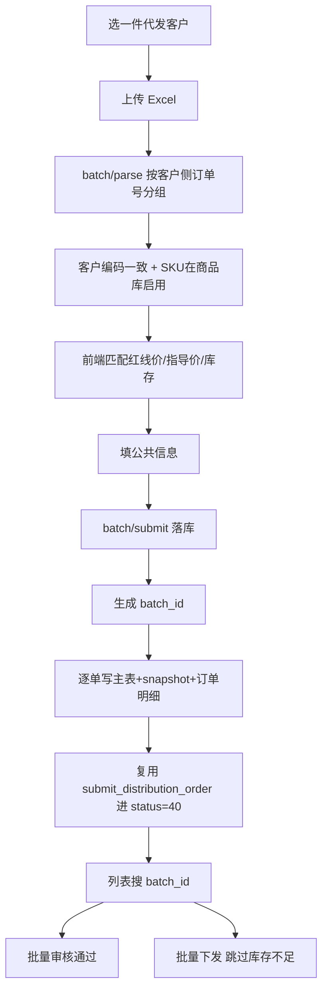

# 一件代发批量建单 / 批量审核下发 — 实现总结

> 面向：一件代发客户（线下客户 `cooperation_method=2`）  
> 目标：Excel 批量建单（跳过报价审核）→ 同 Batch 搜索/批量审核 → 批量下发

---

## 1. 业务背景

| 点 | 说明 |
|----|------|
| 适用客户 | 合作方式 = 一件代发（`OfflineCustomer.cooperation_method=2`） |
| 建单路径 | 跳过草稿/报价审核（10/20），Excel 提交后直进 **订单审核(40)**，不可只存草稿 |
| 聚合规则 | 同一「客户侧订单号」多行 SKU → **1 张订单** |
| 运费 | Excel **每行**有运费 → 写行 `freight_with_vat` → **主单运费 = 行汇总** |
| 批次 | 同一次上传共用一个 `batch_id`（`BatB2B{YYYYMMDD}{四位自增}`），列表可搜，勾选后批量审核 |
| SKU 校验 | 须在商品库 `data_product_sku` 且 `sku_status=1` |

---

## 2. 数据模型

### 2.1 主表扩列 `data_distribution_order`

| 字段 | 类型 | 说明 |
|------|------|------|
| `cooperation_method` | SMALLINT NULL | 合作方式快照：1=批发，2=一件代发；普通 draft/save **以前端 body 为准** |
| `batch_id` | VARCHAR(64) NULL | 批量建单批次号；普通单为 NULL；有索引 |
| `customer_po_no` | VARCHAR(128) NULL | 客户侧订单号 |
| `create_source` | SMALLINT NOT NULL DEFAULT 0 | `0=普通`，`1=一件代发批量`；批量审核仅允许 `=1` |

### 2.2 迁移脚本

| 文件 | 说明 |
|------|------|
| [`migrations/20260803_batch_dropship.sql`](./migrations/20260803_batch_dropship.sql) | 主表扩列等 |
| [`migrations/20260804_order_cooperation_method.sql`](./migrations/20260804_order_cooperation_method.sql) | 若已跑过无 `cooperation_method` 的旧版 0803，补列 |

---

## 3. 接口一览

| 方法 | 路径 | 说明 |
|------|------|------|
| GET | `/distribution_order/batch/dropship_customers/` | 一件代发客户下拉 |
| GET | `/distribution_order/batch/template/` | 空 Excel 模板下载 |
| POST | `/distribution_order/batch/parse/` | multipart 解析 Excel（不落库） |
| POST | `/distribution_order/batch/submit/` | JSON 落库并提交订单审核 |
| POST | `/distribution_order/batch/approve/` | 批量通过（驳回走单条） |
| POST | `/distribution_order/batch/dispatch/` | 批量下发（库存不足跳过） |

列表：`GET /distribution_order/list/` 支持 `batch_id`；出参含 `batch_id` / `customer_po_no` / `create_source` / `cooperation_method`。

---

## 4. 核心流程

### 4.1 批量建单（两步）

1. **parse**：`offline_customer_id` + Excel；返回按行序的扁平 `order_details[]`（预留 `guide_price` / `red_line_price` / `stock_*`）。
2. **submit**：公共字段 + 前端补齐后的 `order_details[]`；后端按客户侧订单号聚合；行运费汇总为主单；同批共用 `batch_id`；`create_source=1`。

成功返回：`{ batch_id, order_ids, order_sns, count }`。

### 4.2 批量审核 / 下发

- approve：仅批量通过；`create_source=1` 且 `status=40`；驳回须单笔填 remark
- dispatch：`status=60`；库存不足进 `skipped`

---

## 5. 实现文件

| 文件 | 职责 |
|------|------|
| `distribution_order_batch_service.py` | 模板、parse、submit、批量审/发（SKU→商品库） |
| `views/distribution_order_batch.py` / `urls.py` | HTTP + 路由 |
| `models.py` / `schemas.py` / `constants.py` | 字段与枚举 |
| `distribution_order_line_service.py` | `create_source=1` 行运费汇总主单 |
| `distribution_order_service.py` | submit 时批量单不走「主单运费分摊到行」 |

---

## 6. 前端对接文档

调用方式、注意事项、Form/JSON 示例、列表变更见：  
[`BATCH_DROPSHIP_FRONTEND.md`](./BATCH_DROPSHIP_FRONTEND.md)
