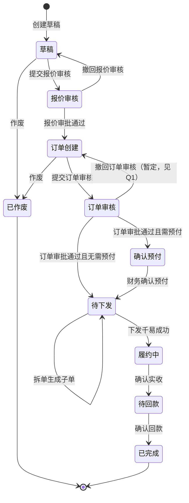

# 分销订单 — 方案设计（草案）

> **状态**：部分决策已确认（§1.1），其余**暂定**沿用草案倾向；定稿 DDL 前**不**生成代码。  
> 产品需求见 [需求文档.md](./需求文档.md)。

---

## 1.1 已确认决策（2026-05-23）


| 编号     | 决策                                                                                                                               |
| ------ | -------------------------------------------------------------------------------------------------------------------------------- |
| **Q2** | 审批**驳回**到任意前置环节时，**不清空**已有订单/报价/附件等数据                                                                                            |
| **Q5** | 合同**有预付**时，订单审核通过后进入 **确认预付**；无预付则直达 **待下发**                                                                                     |
| **Q6** | **允许多次拆单**（同一主单可反复拆，子单号后缀 `-A/-B/...` 递增）；子单免审等待下发等待定细节见 §3.5                                                                    |
| **Q7** | WS 分销单号：`B2B` + `customer_country` + `YYYYMMDD` + **4 位当日自增**（例 `B2BTH202605230001`）；序列表按 **国家+日** 分桶；拆单子单：`{主单号}{后缀}`，不占序号 |
| **Q9** | **本期不考虑**物流状态、千易订单状态的本地枚举/同步/筛选实现（PRD 列展示可后续只读对接）                                                                                |
| **附件** | **不建附件表**；主表 `customer_po_attachments` / `ship_guide_attachments` JSON，后端原样存取；预付/尾款水单见对应确认表 `attachments` |
| **审批** | **不建** `approval` / `approval_node` 实例表；环节 `approval_config`，运行时主表链/步 + `status_log`；引擎见 [`contract_workflow_engine.py`](../offline_customer/contract_workflow_engine.py)（§5.1），**接口**见 [`sys_offline_contract_approve.py`](../offline_customer/view/sys_offline_contract_approve.py)（§5.2） |
| **chain_code** | **1=定价审批**；**2=订单审批-标准**（&lt;5000 USD）；**3=订单审批-大额**（≥5000 USD）；**不设 chain=4**（TH 加审见 Q4） |
| **审批独立** | **定价审批**（`chain_code=1`）与 **订单审批**（`chain_code=2/3`）为**两条独立审批流**：不同时运行、环节 config 互不共用；中间隔 **订单创建**（status=30）；历史与待办按各自 `chain_code` + `action_code` 10–13 / 20–23 分别查询 |
| **字段快照** | PRD「自动带入」「自动计算」结果在 **保存/提交时写入本单表字段**；合同/定价/清关/库存主数据后续变更 **不反写** 已存订单；仅用户主动改单并再次保存时更新 |
| **状态表** | 主表 `current_chain_code`+`current_step`；`status_log` 记录 from/to 链与步；配置见 `approval_config` |
| **店铺** | **不建**千易店铺映射表；`shop_id` 与千易同源，下发时直接传 |
| **其他** | Q1、Q3、Q4、Q8–Q22 → **暂定**，实现按 §8.2 执行，后续可改                                                                                        |


---

## 1. 范围与假设


| 项     | 约定                                                                                    |
| ----- | ------------------------------------------------------------------------------------- |
| 本期范围  | 分销订单全生命周期：列表/详情/状态流转/审批/预付·回款/下发千易/拆单/导出/标签展示                                         |
| 合同与客户 | 主数据来自主仓线下客户模块（`data_sys_offline_customers` / `data_sys_offline_contract` 等），读取与快照规则见 **§4.1.4** |
| 技术栈   | Python 3.8 · FastAPI · Pydantic v1 · SQLAlchemy 2.0 async · MySQL 8.0（`internal_app`） |
| 本期不做  | 分销定价表、活动经费 OA、移动端审批、退货、缺货自动调拨、草稿锁库存（见需求 2.5）                                          |
| 多单核销  | 一笔水单关联多订单 — **本期不校验**（需求 2.5 已说明）                                                     |


---

## 2. 状态机（草案）

状态用 `SMALLINT` 存库，`comment` 写明含义；前端展示中文名。




### 2.1 状态枚举（建议）


| code | 名称   | 可编辑区块（摘要）                        |
| ---- | ---- | -------------------------------- |
| 10   | 草稿   | 客户信息、**报价明细**（每 SKU 报价，§4.2）       |
| 20   | 报价审核 | 只读 + 审批操作                        |
| 30   | 订单创建 | 销售结算、订单明细、物流（需求 2.2.0「订单创建」时机字段） |
| 40   | 订单审核 | 只读 + 审批操作                        |
| 50   | 确认预付 | 预付实付、水单、差异备注                     |
| 60   | 待下发  | 拆单；下发                            |
| 70   | 履约中  | 确认实收                             |
| 80   | 待回款  | 手工调整（时机待确认 Q8）、确认回款              |
| 90   | 已完成  | 只读                               |
| 99   | 已作废  | 只读                               |


### 2.2 标签（建议：列表查询时计算，可选落库缓存）


| 标签   | 计算时机   | 规则摘要                                        |
| ---- | ------ | ------------------------------------------- |
| 价偏   | 实时     | 售出单价 < 红线价                                  |
| 大额   | 实时     | 订单金额（换算 USD）> 5000                          |
| 样品   | 实时     | 含协议样品/折扣样品行                                 |
| 缺货   | 实时/下发前 | 发货仓分销库位 SKU 可用库存不足                          |
| 拆单   | 落库     | 存在子单或 `parent_order_id` 非空                  |
| 特殊作业 | 落库     | `ship_remark` 非空，或 `ship_guide_attachments` 非空 |
| 紧急   | 实时     | 距期望出库 < 48h 且未发货（发货判定 **暂定**；Q9 本期不做千易状态同步） |
| 实收差异 | 落库     | 实收数量 ≠ 订单数量                                 |
| 回款超期 | 实时     | 已过预计回款日且未确认回款                               |
| 待传水单 | 落库     | 已确认预付/回款但水单未传（由**前端** `attachments` 结构判断，后端不解析） |


---

## 3. 核心流程（时序摘要）

### 3.1 创建 → 报价审核（独立审批流 A）

1. `POST .../draft/save/`：不校验必填，状态=草稿；选客户或保存时 **写入主表/报价明细快照**（§4.2、§4.1.3）。
2. `POST .../quote/submit/`：校验客户+报价明细必填 → 状态=报价审核 → 主表 `current_chain_code=1`、`current_step=1` → 待办（仅报价链）；提交前再次固化快照。
3. 报价链终审通过 → 主表链/步 **清空**，状态=订单创建；驳回 → 回退至所选前置节点，**保留全部已填数据**（Q2 已确认）。**不**进入订单审核链。

### 3.2 订单创建 → 订单审核（独立审批流 B）

1. 上传客户采购单；在 **订单明细表**（§4.3）**逐行手工新建**多 SKU 行（单价、数量等与报价单**无关**，须重新填写；SKU 下拉范围见 Q11）。`order/save` 时写入订单头/订单明细行快照（§4.1.3）；本阶段**无**审批环节（status=30，主表链/步为 NULL）。
2. `POST .../order/submit/` → 状态=订单审核 → **重新**按金额 USD 分档选定 `chain_code` 2 或 3（与定价链无关）→ `current_step=1` → 待办（仅订单链）；提交前再次固化快照。

### 3.3 预付 → 下发

1. 若合同**有预付**（Q5 已确认）→ 先进 **确认预付**，财务确认后 → 待下发；无预付 → 直达待下发。
2. `POST .../dispatch/`：校验分销库位可用库存 → 调千易 `qianyi.order.add` → 写千易单号、库存快照 → 履约中。

### 3.4 履约 → 回款

1. `POST .../receive/confirm/`：回填实收数量 → 待回款 → 待办给发起人。
2. 可选：手工调整项（Q8）→ `POST .../payment/confirm/` → 已完成。

### 3.5 拆单（Q6 已确认：可多次拆）

- 仅 **待下发** 状态可操作（主单或仍有余量的父单）。
- 每次拆单：按填入数量扣减对应行，生成**新子单**；子单单号 = `{主单 order_sn}{后缀}`，后缀按已有子单递增 `-A`、`-B`、`-C`…
- **同一主单可多次拆单**，直至各行可发数量为 0 或业务作废（主单余量为 0 时的状态流转：**暂定**保持待下发或只读，见 Q6 暂定）。
- 子单继承父单审批结果，**不再走订单审核**（暂定）；子单独立进入待下发并分别下发。

### 3.6 千易字段映射

与需求 **2.3** 一致；千易 `shop_id` / `shop_code` 直接取主表 **`shop_id`**（分销平台店铺已与千易对齐，**不建映射表**）。

### 3.7 主单号生成（Q7）

**当前实现（暂定）**：`order_sn = B2B + customer_country + YYYYMMDD + 8 位十六进制随机`（`secrets.token_hex(4).upper()`）；与主表插入同事务；碰撞时重试最多 5 次。实现见 `distribution_order_service._allocate_order_sn`。

**后续（待接入）**：日序列表 `data_distribution_order_sn_seq`（按国+日 `FOR UPDATE` 递增 4 位序号），DDL/ORM 草案见下文 §4.0，**暂未写入** [schema.sql](./schema.sql)。

拆单子单号 = `父单 order_sn` + 后缀 `-A/-B/...`，不占日序号。千易 `out_order_sn` 与 `order_sn` 相同。

---

## 4. 表设计（草案）

命名遵循主仓：`internal_app.data_<模块>_<业务>`，主键 `_id`，无 `ForeignKey` 约束。

### 4.0 `data_distribution_order_sn_seq`（分销单号日序列表，**暂未建表**）

按 **国家 + 自然日** 维护序号，并发下用行锁递增；**一行一国一日**。当前阶段未落库，单号用 §3.7 随机方案。


| 字段         | 类型          | 说明                                               |
| ---------- | ----------- | ------------------------------------------------ |
| `_id`      | BIGINT PK   |                                                  |
| `seq_date` | DATE        | 序号日期（服务器自然日，建议业务时区与主仓一致）                         |
| `customer_country` | VARCHAR(64) | 客户国家，与主表 `customer_country` / 主仓 `OfflineCustomer.customer_country` 一致 |
| `last_seq` | INT         | 当日该国已分配的最大序号，范围 1–9999；初始 0，首单分配后为 1               |
| 审计         |             | `create_time` `update_time`（无 `create_by`，系统序列表） |


**索引**：`UNIQUE(seq_date, customer_country)`。

### 4.1 `data_distribution_order`（订单主表）


| 字段                                                 | 类型                 | 说明                                                  |
| -------------------------------------------------- | ------------------ | --------------------------------------------------- |
| `_id`                                              | BIGINT PK          |                                                     |
| `order_sn`                                         | VARCHAR(48) UNIQUE | WS 分销单号 `B2B`+国家+日期+序号，§3.7；子单含后缀如 `-A`              |
| `parent_order_id`                                  | BIGINT NULL        | 拆单父单；NULL=主单；子单后缀写在 `order_sn`（如 `-A`）              |
| `status`                                           | SMALLINT           | §2.1                                                |
| `offline_customer_id`                              | BIGINT             | 外键 → `data_sys_offline_customers._id`（§4.1.4）          |
| `contract_id`                                      | BIGINT NULL        | 外键 → `data_sys_offline_contract._id`（下单时生效合同）         |
| 客户热字段（主表）                                         | 多列                 | `customer_code` / `customer_short_name` / `customer_country` / `customer_type_*`；列表、单号、检索用 |
| `is_prepayment` / `prepayment_ratio`               | SMALLINT/DECIMAL   | 预付快照（主表）；Q5 状态分支依据，见下表                         |
| `settlement_method`                                | SMALLINT NULL      | 结算方式编码快照（主表，列表筛选）；`settlement_days` 仍在 §4.1b   |
| 联系人/地址/合同扩展快照                                     | —                  | 落 **§4.1b** `data_distribution_order_snapshot`（1:1）   |
| 金额汇总                                               | DECIMAL            | 含税/不含税商品总额、运费、订单总额、预付/尾款/EWT 等                      |
| `currency`                                         | VARCHAR(8)         | 合同币种                                                |
| `is_tax_free` / `is_ewt` / `vat_rate` / `ewt_rate` | SMALLINT/DECIMAL   | 免税、预扣税                                              |
| `expected_ship_date`                               | DATE NULL          | 期望出库                                                |
| `actual_ship_date`                                 | DATE NULL          | 实际出库                                                |
| `expected_payment_date`                            | DATE NULL          | 预计回款                                                |
| `actual_payment_date`                              | DATE NULL          | 实际回款                                                |
| `shop_id`                                          | BIGINT NULL        | 出库店铺（与千易 shop_id 同源）                                |
| `sales_user_id`                                    | BIGINT NULL        | 本单销售员                                               |
| `system_tracking_number`                           | VARCHAR(64) NULL   | 千易单号（下发成功后写入）                                       |
| `waybill_no`                                       | VARCHAR(64) NULL   | 运单号（来源待定，本期不做法物流状态机，Q9）                             |
| `remark`                                           | TEXT NULL          | 订单备注（PRD 无字数上限）                                    |
| `ship_remark`                                      | VARCHAR(800) NULL  | 发货备注（PRD 800 字）                                    |
| `receive_diff_remark`                              | VARCHAR(800) NULL  | 实收差异原因（PRD 800 字）                                  |
| `oa_seal_no`                                       | VARCHAR(64) NULL   | 用印 OA 编号                                            |
| `delivery_fee_payment`                             | SMALLINT           | 本次运费承担方 1=Simplus Pay 2=Customer Pay                |
| `ship_guide_attachments`                           | JSON NULL          | 发货指导文件                                       |
| `customer_po_attachments`                          | JSON NULL          | 客户采购单文件附件（订单创建必传）                              |
| `tags_bitmask`                                     | INT NULL           | 可选：缓存标签位图                                           |
| `current_chain_code`                               | SMALLINT NULL      | **当前审批链**（同 config.`chain_code`）；仅 status∈{20,40} 时有值，其余状态 **NULL** |
| `current_step`                                     | INT NULL           | **当前待审环节**（同 config.`step_no`）；与 `current_chain_code` 成对维护，离开审核 **NULL** |
| 审计四件套                                              |                    | `create_time` `update_time` `create_by` `update_by` |
| `is_delete`                                       | TINYINT            | 软删 **0=正常 1=已删**；仅 service 写入；前端删除传 `_id`（见子任务规则 §软删除） |

### 4.1b `data_distribution_order_snapshot`（扩展快照，与主表 1:1）

**已确认（2026-05-26）**：联系人、地址、合同条款/结算/交付/样品/银行等展示型快照自主表拆出，便于后续加字段少迁主表；主表保留客户 id/编码/国家/类型及预付字段。

| 字段 | 说明 |
|------|------|
| `order_id` | PK，= `data_distribution_order._id` |
| `contact_*` | 联系人四列（不落主仓 `contact_id`） |
| `address_*` / `address` / `address_post_code` / `address_remark` | 地址快照 |
| `contract_no` / `contract_effective_*` / `owner_staff_id` / `uncond_rebate_ratio` | 合同展示 |
| `settlement_days` / `settlement_currency` | 结算快照（`settlement_method` 在主表，供列表筛选） |
| `delivery_method` / `carrier` / `delivery_remark` | 配送快照 |
| `sample_policy` / `sample_discount` | 样品政策 |
| `contract_delivery_fee_payment` / `bank_account_confirmation` | 运费承担方、银行 JSON |
| 审计 | `create_time` `update_time` |

**写入**：`draft/save` 与主表**同事务** `INSERT`/`UPDATE`；详情由 service `JOIN` 或两次查询后合并为扁平 DTO（`DistributionOrderOut` 仍扁平）。

**拆单**：子单复制父单快照行（具体是否允许子单改地址 — **暂定**）。

#### 4.1.1 备注字段约定

- **需求文档写了字数上限** → `VARCHAR(上限) NULL`（如 PRD 800 字 → `VARCHAR(800)`），接口校验与库表一致。
- **需求文档未写上限** → **`TEXT NULL`**（如订单通用 `remark`、状态日志 `remark`）。
- `TEXT` 列不设 `DEFAULT`（本仓 `api-patterns` 约定）。

#### 4.1.2 审批链 / 当前步（主表）

主表**同一时刻仅承载一条在审链**（报价 **或** 订单，互斥）。报价终审通过后链/步清空；进入订单审核时**重新选链**，不复用报价环节的 `current_step`。

| 时机 | `current_chain_code` | `current_step` |
|------|----------------------|-----------------|
| 提交报价审核 | `1` | `1` |
| 报价审核中逐步通过 | `1` 不变 | 递增，直至末步通过后 **NULL** 并 status→30 |
| 订单创建（status=30） | **NULL** | **NULL** |
| 提交订单审核 | 按 USD 分档新选 `2`（&lt;5000）或 `3`（≥5000），与 chain=1 无关 | `1` |
| 订单审核中逐步通过/驳回 | 当前订单链不变（驳回回退 step） | 随审核变化 |
| 审核通过/撤回/作废离开审核态 | **NULL** | **NULL** |

每次变更须与 `status_log` 同事务写入（见 §4.5）。

#### 4.1.3 自动带入 / 自动计算字段（快照落库）

对齐 PRD §2.2.0「自动带入」「自动计算」：**写入时机**为 `draft/save`、`quote/submit`、`order/save`、`order/submit`（及行级保存）的**当次** service 计算结果；**详情/列表/导出只读库表**，禁止为展示再去查合同/定价/清关/库存主数据覆盖已存值。

| 范围 | 落库位置 | 说明 |
|------|----------|------|
| 客户信息块「自动带入」 | 主表热字段 + §4.1b | 来源 §4.1.4；`offline_customer_id` / `contract_id` 及客户编码/国家/类型、`is_prepayment` 落主表；联系人/地址/合同扩展落 `snapshot`，**不**存主仓 `contact_id`/`address_id` |
| 报价单/报价明细「自动带入/计算」 | `quote_detail`（§4.2） | 每 SKU：不含税单价、指导价/红线价、行金额、VAT 税额、**保存时**库存三段等；仅草稿/报价审核阶段维护 |
| 订单头「自动带入/计算」 | 主表金额与税率列 | `currency`、`vat_rate`、订单级汇总、预付/尾款/EWT、预计回款日期等 |
| 订单明细「自动带入/计算」 | `item_detail`（§4.3） | 订单创建阶段**单独录入**后的计算/快照：不含税单价、指导价/红线价、行金额、VAT、可用库存快照、`quote_check_passed` 等；**不**从报价明细复制 |

- **例外（Q10）**：一级/二级列表的「当前可用库存」预警可**实时读**库存服务做标红，与行内**已落库**快照并存，下发后履约展示用 `dispatch_stock_snapshot`。
- **更新快照**：仅当用户在对应阶段**改客户、改行、改税率选项并保存**时重算并覆盖；合同主数据事后变更不影响历史单。

DDL 见 [`schema.sql`](./schema.sql)（§4.0–§4.1b–§4.7 整合，与 `models.py` 一一对应）。

#### 4.1.4 线下客户/合同数据来源（主仓）

ORM 参考本仓副本 [`tasks/offline_customer/models.py`](../offline_customer/models.py)（合入主仓：`apps.system.offline_customer.models`）。

**读取时机**：用户选择「客户编码/简称」或 `POST .../draft/save/` 时，由 service **只读**拉取并写入 §4.1.3 快照；详情/列表**不再**联表读客户/合同主表（除 `meta/customers` 等搜索接口）。

**生效合同判定（暂定，Q21 可调整）**：

1. 取 `OfflineCustomer.current_contract_id`（`customer_status=20` 生效中时常有值）。
2. 校验 `OfflineContract.status = 40`（已生效）；不满足则在该客户下查 `status IN (40)` 且日期覆盖当日的合同，或返回「无生效合同」错误。
3. 订单主表写入 `offline_customer_id`、`contract_id`（合同 `_id`）。

**子表（PRD 联系方式/地址下拉）**：

| PRD | 主仓表 | 说明 |
|-----|--------|------|
| 客户编码/简称 | `OfflineCustomer` | `customer_code`、`customer_short_name`；列表/模糊搜索用 |
| 联系方式 | `OfflineCustomerContact` | 下拉选中后拷贝至 §4.1b `contact_*`；**不**落主仓 id、不存拼接文案 |
| 客户地址 | `OfflineCustomerAddress` | 下拉选中后拷贝至 §4.1b `address_*` 等（与主表 `customer_country` 区分前缀） |
| 客户国家 | `OfflineCustomer.customer_country` | 定价/库存/审批办事角色（按国解析办事人） |

**自动带入字段映射（主表快照列 ← 主仓字段）**：

| PRD（客户信息） | 主仓来源 | 主仓字段（示例） |
|-----------------|----------|------------------|
| 客户类型 | `OfflineCustomer` | `customer_type_first` / `customer_type_second`（或 `customer_tag` 展示） |
| 合同编号 | `OfflineContract` | `contract_no` |
| 合同有效日期 | `OfflineContract` | `effective_start`、`effective_end`（拼接展示） |
| 曜曜签订负责人 | `OfflineContract` | 仅存 `owner_staff_id`；姓名展示读时 `UserService` |
| 无条件返利比例 | `OfflineContractUncondRebate` | `data_sys_offline_contract_uncond_rebate` 按 `contract_id` 汇总/取首条 `value`（**待产品确认**展示规则） |
| 是否预付 / 预付比例 | `OfflineContract` | `is_prepayment`、`prepayment_ratio` 原样快照；选合同/提交时写入，不随后续改合同而变 |
| 结算方式 | `OfflineContract` | `settlement_method` 落**主表**；`settlement_days` 落 §4.1b；展示文案读时字典/翻译拼接，**不落库** `*_str` |
| 交付方式 | `OfflineContract` | `delivery_method` 编码；展示文案读时翻译 |
| 运输及配送 | `OfflineContract` | `carrier`、`delivery_remark` |
| 样品政策 | `OfflineContract` | `sample_policy`、`sample_discount` |
| 运费承担方 | `OfflineContract` | `delivery_fee_payment` |
| 客户银行账户信息 | `OfflineContract` | `bank_account_confirmation`（JSON 原样快照） |
| 币种（报价/订单头） | `OfflineCustomer` / 合同 | `settlement_currency` 或合同 `mt_currency`（**与 PRD「合同币种」对齐规则待确认**） |

**枚举展示**：结算方式、交付方式、运费承担方等仅存 **int 编码**（及 `settlement_days` 等必要字段）；前端/详情展示时按主仓字典或 `translate_all_output` 生成文案，**禁止**再落库 `settlement_method_str` 等冗余列。

**本任务不新建客户/合同表**；`GET .../meta/customers/` 可调主仓已有客户搜索接口，或薄封装 `OfflineCustomer` 模糊查询。

**索引建议**：`order_sn`，`status`，`offline_customer_id`，`parent_order_id`，`create_time`，`expected_ship_date`，`expected_payment_date`；可选 `KEY(status, current_chain_code, current_step)` 供待办列表。

### 4.2 `data_distribution_order_quote_detail`（报价明细表）

对应 PRD **报价单**区块：主单下 **每个 SKU 一行**，记录该 SKU 的含增值税报价、数量，及保存时固化的定价/行金额/库存快照（草稿、报价审核阶段维护）。**不是**订单创建阶段的订单明细（§4.3）。

| 字段 | 说明 |
|------|------|
| `order_id` | 主单 `_id` |
| `line_no` | 行序 |
| `sku` | 报价单-SKU（下拉选商品） |
| `price_with_vat` | 报价单-含增值税报价（**手动**） |
| `price_without_vat` | 报价单-不含增值税单价（保存时按 VAT 计算落库） |
| `qty` | 报价单-销售数量（**手动**） |
| `guide_price` / `red_line_price` | 报价单-指导价/红线价（保存时定价快照） |
| `amount_with_vat` / `amount_without_vat` / `vat_amount` | 报价单-行金额/VAT（保存时计算落库） |
| `stock_on_hand` / `stock_in_transit` / `stock_planned` | 报价单-库存展示（保存时快照，§4.1.3、Q10） |
| `is_delete` | 软删；删行传 `_id` |
| 审计 | `create_time` `update_time` 等 |

**索引建议**：`KEY(order_id)`，`KEY(order_id, is_delete)`；无 `(order_id, sku)` 唯一键；`is_delete=0` 时同单同 SKU 唯一由 **save 时 service 校验**；删行传 `_id` 软删后可再录同 SKU。

### 4.3 `data_distribution_order_item_detail`（订单明细表）

对应 PRD **订单创建**阶段多 SKU 行（status=30 起维护）。与 §4.2 **分表存储**，报价审核通过后**不复制**报价明细；用户在订单创建时 **重新手工录入** 下列字段（自动带入/自动计算结果在 `order/save` 时落库快照）：

| 字段 | PRD 字段 | 填写/计算 |
|------|----------|-----------|
| `order_id` | — | 主单 `_id` |
| `line_no` | — | 行序 |
| `sku` | 订单创建-SKU编码 | **手动**（下拉；可选限制为本单报价明细已出现的 SKU，见 Q11） |
| `price_with_vat` | 订单创建-含增值税单价 | **手动** |
| `price_without_vat` | 订单创建-不含增值税单价 | 保存时按 VAT 计算 |
| `guide_price` / `red_line_price` | 订单创建-指导价/红线价 | 保存时定价快照 |
| `qty` | 订单创建-销售数量 | **手动** |
| `stock_on_hand` / `stock_in_transit` / `stock_planned` | 订单创建-可用库存 | 保存时库存快照 |
| `amount_with_vat` | 订单创建-含增值税总额 | 行级：单价×数量，保存时计算 |
| `amount_without_vat` | 订单创建-不含增值税总额 | 行级，保存时计算 |
| `vat_amount` | 订单创建-VAT税额 | 行级，保存时计算 |
| `is_protocol_sample` | 订单创建-协议样品 | **手动** |
| `quote_check_passed` | 订单创建-报价校验 | 保存时按规则计算（与报价单勾选**无关**） |
| `received_qty` | — | 履约后填实收数量 |
| `dispatch_stock_snapshot` | — | 下发时可用库存快照（履约中列表） |
| `is_delete` | 软删；删行传 `_id` |

订单级 **EWT 税额**、运费、订单总额汇总等落在 **主表** 金额字段（非行表重复列）。行表与报价单**无继承关系**，仅业务上可选约束 SKU 范围。

**索引建议**：同 §4.2（软删 + 应用层 SKU 唯一；见 Q11）。

#### 4.3.1 报价明细 vs 订单明细

| 项 | 报价明细 §4.2 | 订单明细 §4.3 |
|----|---------------|---------------|
| 维护时机 | 草稿、报价审核 | 订单创建及之后 |
| 业务含义 | 每 SKU **报价**（单价、数量、行金额等） | 每 SKU **订单行**（实单单价、数量、校验等） |
| 与另一表关系 | 独立 | 独立；**不**从报价明细复制单价/数量 |
| PRD 模块 | 报价单 | 订单创建-SKU/单价/数量/校验等 |


### 4.4 `data_distribution_order_approval_config`（审批链配置 + 环节快照）

对齐主仓 `data_sys_offline_contract_approval_config`。**审批环节不另建节点快照表**——提交/审核时按 `chain_code` 查询本表；**主表**存当前 `current_chain_code` + `current_step`；**status_log** 存每次迁移的 `from/to` 链与步。

**定价审批与订单审批独立**：`chain_code=1` 与 `2/3` 为两套 config 行集合；无共用环节序号；查询审批流、待办、通过/驳回时**禁止**把两条链拼成一条时间轴（详情页可上下两块分别展示）。

**环节逻辑差异**（配置数据，非代码硬编码）：

| 链 | 环节设计 |
|----|----------|
| **1 定价审批** | 固定三级办事角色：`定价审批人-1` → `定价审批人-2` → `定价审批人-3`（`approver_type=2`，各步 `role_id` 指向主仓 `business_role`） |
| **2/3 订单审批** | 直线上级（`approver_type=1`）→ 分销主管；大额 chain=3 末步加 CEO |

| 字段 | 类型 | 说明 |
|------|------|------|
| `_id` | BIGINT PK | |
| `chain_code` | SMALLINT | 审批链：1=定价审批 2=订单审批-标准(&lt;5000USD) 3=订单审批-大额(≥5000USD) |
| `step_no` | INT | 环节序号 1..N，**同一 chain_code 内唯一** |
| `approver_type` | SMALLINT | 1=直线上级(动态解析) 2=办事角色(用 role_id) |
| `role_id` | INT | `business_role.role_id`；`approver_type=1` 时填 0 |
| `role_name` | VARCHAR(64) | 办事角色名称或「直线上级」 |
| `is_active` | SMALLINT | 0=停用 1=启用 |
| `create_time` / `update_time` | DATETIME | |

**索引**：`UNIQUE(chain_code, step_no)`，`KEY(is_active, chain_code, step_no)`。

**链路与 PRD 对应（配置数据，非硬编码）**：

| chain_code | 环节 step_no | approver_type | role_name（示例） |
|------------|-------------|---------------|-------------------|
| 1 定价审批 | 1 | 2 | 定价审批人-1 |
| 1 定价审批 | 2 | 2 | 定价审批人-2 |
| 1 定价审批 | 3 | 2 | 定价审批人-3 |
| 2 订单审批-标准 | 1 | 1 | 直线上级 |
| 2 订单审批-标准 | 2 | 2 | 分销主管 |
| 3 订单审批-大额 | 1 | 1 | 直线上级 |
| 3 订单审批-大额 | 2 | 2 | 分销主管 |
| 3 订单审批-大额 | 3 | 2 | CEO |

提交定价/订单审核时选定 `chain_code`（报价恒为 1；订单为 2 或 3）→ 主表 `current_chain_code` + `current_step=1`，并写 status_log 的 `to_chain_code` / `to_step`。

DDL：[schema.sql](./schema.sql) §4.4

### 4.5 `data_distribution_order_status_log`（主状态迁移日志）

对齐主仓 `data_sys_offline_contract_status_log`：**每次合法状态迁移一条**，用于审计、对账与审批步数追踪。

| 字段 | 类型 | 说明 |
|------|------|------|
| `_id` | BIGINT PK | |
| `order_id` | BIGINT | 订单主键 |
| `from_status` | INT NULL | 变更前主状态（§2.1）；首条可为 NULL 或 10 |
| `to_status` | INT NOT NULL | 变更后主状态 |
| `action_code` | INT NULL | 业务动作编码（附录 A.1） |
| `operator_id` | BIGINT NULL | 操作人；系统/定时可 0 |
| `operator_role` | INT NULL | 1=发起人 2=审核人 3=管理员 4=系统（附录 A.2） |
| `trigger_type` | INT NOT NULL | 1=人工 2=定时 3=审核链路 4=系统其他（附录 A.3） |
| `remark` | TEXT NULL | 补充说明（驳回原因、系统说明等） |
| `from_chain_code` | SMALLINT NULL | 变更前审批链（同主表 / config.`chain_code`） |
| `to_chain_code` | SMALLINT NULL | 变更后审批链；离开审核态可为 NULL |
| `from_step` | INT NULL | 变更前环节（config.`step_no`） |
| `to_step` | INT NULL | 变更后环节；离开审核态可为 NULL |
| `role_name` | VARCHAR(64) NULL | 本步办事角色名称快照（`approval_config.role_name`）；非审核为 NULL |
| `create_time` | DATETIME | 状态切换完成时间 |

**写入规则**：

| 场景 | `from_*` / `to_*` |
|------|-------------------|
| 提交进入审核 | `from_chain_code`=NULL，`to`=chain；`from_step`=NULL，`to_step`=1 |
| 审核通过下一步 | chain 前后相同；`from_step`→`to_step` 递增 |
| 审核终审通过 | `to_chain_code`/`to_step` 可 NULL（与主表清空一致） |
| 驳回 | 保留 chain；`to_step`=驳回目标步 |
| 非审核动作（下发等） | 链/步/`role_name` 均为 NULL |
| 审批相关动作 | `role_name` 写入当时环节 `approval_config.role_name` 快照（提交用 `to_step`，通过/驳回/撤回用 `from_step`） |

**索引**：`KEY(order_id)`，`KEY(order_id, create_time)`。

- 驳回（Q2 已确认）：写 log 后**不清空**业务数据，回退主表 `status` / `current_step`（`current_chain_code` 保留至离开审核态）。

DDL：[schema.sql](./schema.sql) §4.5

运行时审批状态仅依赖：**主表** `current_chain_code` / `current_step` + **status_log** + **approval_config**；**不建** `data_distribution_order_approval` 实例表。

### 4.6 `data_distribution_order_adjustment`（手工调整）


| 字段                       | 说明          |
| ------------------------ | ----------- |
| `order_id`  |             |
| `adjust_amount`          | 手工调整金额      |
| `fee_category_id`        | 费用项类目ID       |
| `remark`                 | VARCHAR(800) NULL | 手工调整备注（PRD 800 字） |
| `adjusted_balance_after` | DECIMAL           | 本条后的调整后尾款应收 |
| `seq`                    | INT               | 序号 |


### 4.7 预付/尾款确认（独立两张表）

预付与尾款语义、操作时机、水单类型不同，分两张表存储，避免 `payment_type` 字段带来的查询/校验耦合。

#### 4.7a `data_distribution_order_prepayment`（预付款确认记录）

每次「确认预付」操作一条；用于多次确认与审计追溯。

| 字段                           | 说明                                           |
| ---------------------------- | -------------------------------------------- |
| `order_id`                   | 订单主键                                         |
| `amount_due` / `amount_paid` | 应付/实付预付款                                     |
| `payment_date`               | 支付日期（PRD 必填，Q12 已确认）                          |
| `diff_remark`                | VARCHAR(800) NULL 差异备注（PRD 800 字）             |
| `attachments`                | 水单附件 JSON                                    |
| `system_tracking_number`     | 千易单号快照（确认时从主单同步，便于水单与千易单号关联）                |

#### 4.7b `data_distribution_order_balance_payment`（尾款确认记录）

每次「确认回款」操作一条；字段语义与预付表对齐。

| 字段                           | 说明                                           |
| ---------------------------- | -------------------------------------------- |
| `order_id`                   | 订单主键                                         |
| `amount_due` / `amount_paid` | 应付/实付尾款（应付含手工调整后的最新值）                          |
| `payment_date`               | 回款日期                                         |
| `diff_remark`                | VARCHAR(800) NULL 差异备注（PRD 800 字）             |
| `attachments`                | 水单附件 JSON                                    |
| `system_tracking_number`     | 千易单号快照（确认时从主单同步）                              |


---

## 附录 A. 状态日志编码（与合同模块同类约定）

### A.1 `action_code`（主状态变更动作）

| code | 含义 |
|------|------|
| 10 | 提交报价审核 |
| 11 | 报价审核通过 |
| 12 | 报价审核驳回 |
| 13 | 撤回报价审核 |
| 20 | 提交订单审核 |
| 21 | 订单审核通过 |
| 22 | 订单审核驳回 |
| 23 | 撤回订单审核 |
| 30 | 确认预付 |
| 40 | 下发千易 |
| 41 | 拆单 |
| 50 | 确认实收 |
| 60 | 确认回款 |
| 90 | 作废 |
| 91 | 保存草稿（可选，仅审计） |

### A.2 `operator_role`

| code | 含义 |
|------|------|
| 1 | 发起人 |
| 2 | 审核人 |
| 3 | 管理员 |
| 4 | 系统 |

### A.3 `trigger_type`

| code | 含义 |
|------|------|
| 1 | 人工 |
| 2 | 定时 |
| 3 | 审核链路 |
| 4 | 系统其他 |

---

## 5. API 清单（草案）

路径前缀建议：`/distribution_order/`（挂载方式以主仓为准）。  
列表统一：`page`、`page_size`、`keyword`、`is_download`；筛选项 JSON 字符串 `ast.literal_eval`（见 api-patterns）。

**命名**：本任务接口 Query/Body/响应 JSON 字段统一 **`snake_case`**（与 view、service、Pydantic 一致），**不使用**驼峰或 `Field(alias=...)`。


| 方法   | 路径                                      | 说明                                                      |
| ---- | --------------------------------------- | ------------------------------------------------------- |
| GET  | `/distribution_order/list/`             | 一级列表 + 筛选；`is_download` 导出                              |
| GET  | `/distribution_order/detail/`           | 详情（含进度条、各模块字段）                                          |
| GET  | `/distribution_order/approval/quote/flow/` | **报价审核**审批流（chain=1，见 §5.1）                              |
| GET  | `/distribution_order/approval/order/flow/` | **订单审核**审批流（chain=2/3，见 §5.1）                            |
| GET  | `/distribution_order/quote_details/`    | 报价明细列表（`order_id`）                                          |
| POST | `/distribution_order/quote_details/save/` | 报价明细批量保存（`lines` 一条流：无 `_id` 新增，有 `_id` 更新，`_id`+`is_delete≠0` 删） |
| POST | `/distribution_order/quote_details/delete/` | 报价明细批量软删（可选，等价于 save 里删行）                         |
| GET  | `/distribution_order/order_details/`    | 订单明细列表（`order_id`）                                          |
| POST | `/distribution_order/order_details/save/` | 订单明细批量保存（规则同报价 `save`）                              |
| POST | `/distribution_order/order_details/delete/` | 订单明细批量软删（可选）                                       |

报价/订单明细 **共用** `distribution_order_line_service`；`draft/save` 内嵌 `quote_details` 同规则，`deleted_quote_detail_ids` 仅兼容旧前端。
| POST | `/distribution_order/draft/save/`       | 保存草稿（报价阶段）                                              |
| POST | `/distribution_order/quote/submit/`     | 提交报价审核（对齐合同 `submit_contract`，§5.2）                    |
| POST | `/distribution_order/order/save/`       | 订单创建阶段保存草稿                                              |
| POST | `/distribution_order/order/submit/`     | 提交订单审核（body 含 `chain_code` 2 或 3，§5.2）                 |
| POST | `/distribution_order/approval/quote/approve/`  | 报价审核-通过（§5.2）                                       |
| POST | `/distribution_order/approval/quote/reject/`   | 报价审核-驳回（§5.2）                                       |
| POST | `/distribution_order/approval/quote/withdraw/` | 报价审核-撤回（§5.2）                                       |
| POST | `/distribution_order/approval/order/approve/`  | 订单审核-通过（§5.2）                                       |
| POST | `/distribution_order/approval/order/reject/`   | 订单审核-驳回（§5.2）                                       |
| POST | `/distribution_order/approval/order/withdraw/` | 订单审核-撤回（§5.2）                                       |
| POST | `/distribution_order/void/`             | 作废                                                      |
| POST | `/distribution_order/prepay/confirm/`   | 确认预付                                                    |
| POST | `/distribution_order/dispatch/`         | 下发千易                                                    |
| POST | `/distribution_order/split/`            | 拆单                                                      |
| POST | `/distribution_order/receive/confirm/`  | 确认实收                                                    |
| POST | `/distribution_order/adjustment/add/`   | 新增手工调整                                                  |
| POST | `/distribution_order/payment/confirm/`  | 确认回款                                                    |
| POST | `/distribution_order/quote/import/`     | 报价批量上传                                                  |
| GET  | `/distribution_order/quote/template/`   | 报价模板下载                                                  |
| GET  | `/distribution_order/export/detail/`    | 详情导出（OSS 链接）                                            |
| GET  | `/distribution_order/meta/customers/`   | 客户模糊搜索（或调主仓已有接口）                                        |
| GET  | `/distribution_order/meta/shops/`       | 按国家店铺下拉                                                 |
| GET  | `/distribution_order/meta/skus/`        | SKU 搜索                                                  |
| GET  | `/distribution_order/meta/sales_users/` | B2B 销售员                                                 |


### 5.1 审批流获取接口（报价 / 订单各一套）

**结论：现有表结构已够用，不必新增审批实例表**；缺的是**两条独立**读接口与 **status_log 写入规范**（每一步通过/驳回都必须落一条带 `from_step`/`to_step`/`action_code` 的日志）。

**报价审核**与**订单审核**是独立业务流程：不同 `chain_code`、不同主状态（20 / 40）、不同 `action_code` 段（10–13 / 20–23），中间经 **订单创建**（30）衔接；**禁止**合并为一条「整单审批时间轴」或默认「当前轮」混查。

#### 实现参考：合同审批引擎（主仓对齐）

本仓卫星副本（合入主仓时路径一般为 `apps.system.offline_customer`）：

| 文件 | 职责 |
|------|------|
| [`tasks/offline_customer/contract_workflow_engine.py`](../offline_customer/contract_workflow_engine.py) | 配置驱动多步审批：**状态机** `_TRANSITIONS`、**流转** `apply_transition`、**写日志** `_write_status_log`、**读进度** `load_workflow_bundle`、**待审人** `get_approval_users` / `_get_next_step` |
| [`tasks/offline_customer/view/sys_offline_contract_approve.py`](../offline_customer/view/sys_offline_contract_approve.py) | view 调引擎：`submit` / `approve` / `reject` / `withdraw` → `apply_transition`；详情拼 `load_workflow_bundle` |

分销订单建议新增 **`distribution_order_workflow_engine.py`**（命名可随主仓目录调整），**结构对齐合同引擎**；引擎行为详见 **[workflow_engine.md](./workflow_engine.md)**，差异如下：

| 合同引擎 | 分销订单 |
|----------|----------|
| 单条审批链 `ContractApprovalConfig` | 按 `chain_code` 读 `approval_config`；**定价 chain=1** 与 **订单 chain=2/3** 两套独立入口 |
| `contract.current_step` | `current_step` + `current_chain_code`（成对维护，见 §4.1.2） |
| `OfflineContractStatusLog`（无 chain 字段） | `status_log` 增加 `from_chain_code` / `to_chain_code` |
| `ACTION_SUBMIT/APPROVE/REJECT/WITHDRAW`（1–4） | 报价 10–13、订单 20–23（附录 A.1） |
| `reject_to_info`（dict：`to_status`、`to_step_no`） | body `reject_to_step`（+ 目标 `to_status`，Q2 回退前置环节且**不清**业务数据） |
| `load_workflow_bundle` → `history_steps` + `next_steps` | `load_quote_workflow_bundle` / `load_order_workflow_bundle`，分别供两个 flow 接口 |
| 合同 `apply_transition` 内 `commit` | 本任务按 api-patterns：**engine 不 commit**，由 view `try/commit/rollback`（参考引擎逻辑，事务边界以本任务为准） |

**引擎核心函数（建议）**：

```text
_load_approval_steps(session, chain_code)     # 对齐合同 _load_approval_steps，加 chain 条件
_assert_transition(phase, from_status, action)
apply_transition(session, *, order_id, phase, action, operator_id, remark, reject_to_step=None)
_write_status_log(...)                        # 含 from/to_status、from/to_step、from/to_chain_code
load_quote_workflow_bundle(session, order_id)
load_order_workflow_bundle(session, order_id)
get_approval_users(session, country, role_id) # 可复用合同 SQL/封装；approver_type=1 走直线上级
```

**flow 接口响应**（对齐 `load_workflow_bundle` 语义，字段 **snake_case**）：

```python
{
    "order_sn": "...",
    "order_status": 20,
    "order_status_str": "报价审核",
    "current_chain_code": 1,
    "current_step": 2,
    "history_steps": [],   # 由 status_log 组装，含 operator_name、action_code_str、operated_at、remark
    "next_steps": [],      # config 未办环节 + 待审人（action_code_str: 办理中/待办理）
}
```

view 层：见 **§5.2**（`views/distribution_order_approve.py`，按报价/订单拆接口）；`GET .../approval/*/flow/` 只读调 `load_*_workflow_bundle`。

#### 数据来源分工（单条链内）

| 展示内容 | 来源 |
|----------|------|
| 环节定义（角色名、顺序） | `approval_config` 按**本条接口固定**的 `chain_code` |
| 当前待审环节 | 主表 `current_chain_code` + `current_step`（定价接口仅 status=20 且 chain=1；订单接口仅 status=40 且 chain∈{2,3}） |
| 已发生动作 | `status_log` 仅筛本条链：`action_code` 10–13（报价）或 20–23（订单），且 `to_chain_code` / 链内 `from_step` 与目标 chain 一致 |
| 未来环节及待审人 | 该 chain 的 config 中 `step_no > current_step`，**实时解析** approver |

#### 请求（分接口，无 phase 参数）

| 路径 | Query | 固定 chain | 适用主状态 | log `action_code` |
|------|-------|------------|------------|-------------------|
| `GET /distribution_order/approval/quote/flow/` | `order_id: int` | `1` | 报价审核中，或已结束报价链查历史 | 10–13 |
| `GET /distribution_order/approval/order/flow/` | `order_id: int` | 主表 chain 或该单 `action_code=20` log 的 `to_chain_code` | 订单审核中，或已结束订单链查历史 | 20–23 |

```python
async def approval_quote_flow(
    order_id: int,
    bi_session: AsyncSession = Depends(get_async_data_session),
    ...
) -> Dict[str, Any]:
    ...
```

订单创建（status=30）且未提交订单审核时，订单流接口可返回 `steps=[]`（或仅历史 `events`，若曾提交后撤回）。

响应字段同 snake_case，如 `step_status`：`1` 待审 `2` 未来 `3` 已通过 `4` 已驳回 `5` 已跳过。

#### 组装逻辑（引擎内，报价 / 订单各一 `load_*_workflow_bundle`）

实现时**优先复用** `contract_workflow_engine.load_workflow_bundle` 的组装思路（日志升序 → `history_steps`；按 `current_step` / 末条 log 推 `next_steps`），并加上表约束：

1. 按上表确定 `chain_code`（报价恒为 1；订单从主表或该 chain 最近一条 `action_code=20` 的 log 取）。
2. `_load_approval_steps(session, chain_code)` → `ORDER BY step_no`。
3. 读 `status_log` → **仅** `order_id` + 本 chain + 对应 `action_code` 段；**禁止**混入另一 chain。
4. 审核中且主表 `current_chain_code` 匹配 → 用 `current_step` 区分已办/待办/未来；否则仅历史。
5. `next_steps` 待审人：`get_approval_users`（办事角色）或直线上级解析（`approver_type=1`），与合同一致。

#### 写入规范（否则历史不完整）

| 动作 | 必写 status_log |
|------|-----------------|
| 提交报价/订单审核 | `action_code` 10/20，`to_chain_code`，`to_step=1` |
| 中间环节通过 | 11/21，`from_step`→`to_step` 递增，同步更新主表 `current_step` |
| 终审通过 | 11/21 或单独终态 log + `to_status` 变更，主表链/步 **NULL** |
| 驳回 | 12/22，`to_step`=驳回目标，`remark`=原因 |
| 撤回 | 13/23，链/步清空 |

#### 与详情接口关系

- **推荐独立** `approval/quote/flow/`、`approval/order/flow/`：详情可内嵌 `quote_approval_flow` / `order_approval_flow` 两块（复用对应 service，**禁止**单字段混链）。

#### 仍不满足时再考虑（本期不必）

- 办事角色人员变动后「历史显示当时解析的待审人」→ 需在通过时把 `expected_approvers` 快照进 log（JSON），当前用 `actual_operator` / `actual_operator_name` 即可。
- 同一条链内多轮驳回重提 → 该 chain 的 `events` 全量时间线；**不**与另一 chain 的 events 合并。

**Session**：只读 → `inter_session`。  --> 对应库： internal_app

**Session 分工（建议）**


| 接口类型       | Session                              |
| ---------- | ------------------------------------ |
| 列表、详情只读    | `bi_session` 为主；写日志用 `inter_session` |
| 保存、状态变更、下发 | `inter_session`                      |


### 5.2 审批动作接口（实现参考合同 approve view）

参考 [`tasks/offline_customer/view/sys_offline_contract_approve.py`](../offline_customer/view/sys_offline_contract_approve.py)。合入主仓后建议 **`views/distribution_order_approve.py`**（或并入 `views/distribution_order.py`），**禁止**合并报价/订单为单一 `approve` 接口（与 §审批独立 一致）。

#### 合同 ↔ 分销路径对照

| 合同 `sys_offline_contract_approve` | 分销订单（本任务） | 引擎 `action` |
|--------------------------------------|-------------------|---------------|
| `submit_contract` | `POST .../quote/submit/` | `ACTION_QUOTE_SUBMIT` (10) |
| — | `POST .../order/submit/` | `ACTION_ORDER_SUBMIT` (20) + `chain_code` |
| `approve_contract` | `POST .../approval/quote/approve/` / `.../order/approve/` | 11 / 21 |
| `reject_contract` | `POST .../approval/quote/reject/` / `.../order/reject/` | 12 / 22 |
| `withdraw_contract` | `POST .../approval/quote/withdraw/` / `.../order/withdraw/` | 13 / 23 |
| `get_workflow` | `GET .../approval/quote/flow/` / `.../order/flow/` | 只读 bundle |

#### 请求体（Pydantic v1，snake_case）

对齐合同 `TransitionBody`，本任务统一：

```python
class TransitionBody(BaseModel):
    order_id: Optional[int] = None
    remark: Optional[str] = None
    chain_code: Optional[int] = None          # 仅 order/submit：2 或 3
    reject_to_info: Optional[Dict[str, Any]] = None  # 驳回目标，见下
```

`reject_to_info` 与合同一致，引擎侧映射为 `reject_to_step` / `reject_to_status`：

| 键 | 含义 |
|----|------|
| `to_step_no` | 驳回至环节序号（config.`step_no`） |
| `to_status` | 驳回后主状态；缺省：报价链→10 草稿，订单链→30 订单创建（Q1 撤回为 30） |
| `operator_role` | 可选，写入 log |

合同 `reject_contract`：`to_status == 10` 时置 `reject_to_info = None`（整单回草稿）；分销 **Q2** 回退前置环节时**必须**带 `to_step_no`，且**不清**业务数据。

#### 响应体

合同用 `ResultResponse`；本任务按 **api-patterns** 返回：

```python
return {
    "code": 200,
    "msg": "操作成功",
    "data": {
        "order_id": 1,
        "from_status": 20,
        "to_status": 30,
        "current_chain_code": None,
        "current_step": None,
        "total_steps": 2,
        "message": "...",
    },
}
```

业务失败：`code` 40000/40001 等，`msg` 中文，**不** `raise HTTPException`（HTTP 层仍 200）。

#### view 内公共流程（对齐 `_do_transition`）

```text
1. request.user.id → operator_id；取 order 校验存在、未删除
2. 按接口类型校验主表 status（报价接口仅 20，订单接口仅 40；submit 另见 §3）
3. 权限：对齐 _judge_role_match / _get_user_valid_role_step
   - SQL 表改为 data_distribution_order_approval_config，且 WHERE chain_code = 当前链
   - approver_type=1（直线上级）单独解析，不走过办事角色 SQL
4. 驳回：remark 必填（合同 reject_contract 同）
5. try:
     order, meta, message = await apply_transition(inter_session, order_id=..., action=..., ...)
     await inter_session.commit()
   except ValueError → return 40000
6. 成功返回 meta 入 data
```

`quote/submit`、`order/submit` 在提交前做**业务必填**校验（合同 `_validate_contract_fields` + 报价明细/订单明细非空）；`order/submit` 另校验 `chain_code` 与 USD 分档（Q3）：&lt;5000 USD → 2，≥5000 → 3。

#### 权限与待审人（复用合同 SQL 模式）

| 函数（合同） | 分销适配 |
|-------------|----------|
| `_get_user_valid_role_step` | `user_id` + `country` + `current_step` + **`chain_code`** |
| `_judge_role_match` | 当前 `current_step` 是否落在用户办事角色；直线上级环节单独判断 |
| `_get_contract_valid_role_step` | 提交前校验该国是否存在审批人（`quote/submit`、`order/submit`） |
| `get_country_by_customer_id` | `offline_customer_id` → 客户国家 |

#### 翻译与 flow 读接口

- 写操作：`translate_all_output(modules=[...])` 可选，与合同 `offline_customer` 模块一致。
- `GET .../approval/quote/flow/`：对齐 `get_workflow`，调 `load_quote_workflow_bundle`；`translatable_fields` 含 `action_code_str`、`from_status_str`、`role_name` 等（合同 `get_workflow` 装饰器字段）。
- 订单 flow 同理 `load_order_workflow_bundle`。

#### 实现文件（合入主仓前本仓草案）

| 文件 | 说明 |
|------|------|
| `distribution_order_workflow_engine.py` | 已有；`apply_transition`、`*_workflow_bundle` |
| `views/distribution_order_approve.py` | 待建；按上表拆 8 个路由处理函数 + `_do_transition` |
| `urls.py` | `api.post(...)(fn)` 绑定，见 api-patterns |

---

## 6. 外部依赖（契约待补）


| 依赖      | 用途                 | 本任务需要的信息                                     |
| ------- | ------------------ | -------------------------------------------- |
| 线下客户/合同 | 客户、地址、联系人、合同条款     | **已映射** §4.1.4；主仓 ORM `OfflineCustomer` / `OfflineContract` 及联系人/地址/返利子表；`meta/customers` 路径 **Q21** |
| 商品/定价   | SKU、指导价、红线价、日常售价   | 计算公式已在需求中                                    |
| 库存      | 主仓-分销库位 在库/在途/计划   | 国家+SKU+店铺维度                                  |
| 清关      | 国家 VAT 税率          |                                              |
| 花名册     | B2B 销售员            | 团队标签过滤规则                                     |
| 分销店铺    | 出库店铺               | 按客户国家过滤                                      |
| 利润中心    | 手工调整费用项            |                                              |
| 千易开放平台  | `qianyi.order.add` | AppKey、错误码、幂等；`out_order_sn` = WS `order_sn` |
| WS 订单履约 | 千易订单状态展示           | **本期不做**（Q9）                                 |
| 首页待办    | 审批/预付/回款待办         | 创建待办 API、优先级规则                               |
| OSS     | 附件上传               | 上传接口、导出 URL 生成规则                             |
| 审批组织    | 直线上级、办事角色          | 角色 ID；按客户国家解析办事人                         |


---

## 7. 验收标准（草案，确认后写入 README / .md）

- 列表：§2.1 全部筛选项与一级/二级列数据正确
- 状态：§2.1 状态表各操作按钮仅在对应状态出现且流转正确
- 标签：§2.1 标签逻辑与需求一致（含价偏/缺货/紧急等）
- 详情：§2.2.0 各时机字段读写权限正确
- 审批：定价链、订单链**独立**展示与待办；订单按 USD 分档（2 标准 / 3 大额）及待办文案/优先级
- 下发：库存不足拦截；成功写千易单号；字段映射 §2.3
- 拆单：子单号后缀、不可合并、独立下发
- 导出：列表平铺、详情含 OSS 附件链接
- 权限：§2.4 tab 与操作权限（角色矩阵确认后测）

---

## 8. 问题跟踪（已确认 / 暂定）

### 8.1 已确认


| 编号     | 结论                                                                                           |
| ------ | -------------------------------------------------------------------------------------------- |
| **Q2** | 驳回**不清空**任何已保存业务数据                                                                           |
| **Q5** | 合同**有预付** → 订单审核通过后进 **确认预付**；否则 **待下发**                                                     |
| **Q6** | **可多次拆单**；子单号 `主单号-A/B/...`；子单免审（暂定）                                                         |
| **Q7** | 单号：`B2B` + `customer_country` + `YYYYMMDD` + 4 位日自增（序列表按国+日）；千易 `out_order_sn` 同 WS 单号 |
| **Q9** | 本期**不做**物流状态、千易订单状态的存储/同步/筛选                                                                 |
| **附件** | 主表 `customer_po_attachments` / `ship_guide_attachments` JSON；水单见预付/尾款表 `attachments` |
| **审批** | 仅 `approval_config`；**无** `approval` / `approval_node` 实例表；运行时主表链/步 + `status_log` |
| **chain_code** | 1=定价审批；2=订单审批-标准；3=订单审批-大额；不设 chain=4 |
| **审批独立** | 定价审批（chain=1）与订单审批（chain=2/3）**两条独立流**；分接口查流；中间 status=30 无审批 |
| **字段快照** | 自动带入/计算字段保存时落库，不随合同/定价/库存主数据事后变更 |
| **状态表** | 主表 `current_chain_code`+`current_step`；`status_log` 记录 from/to 链与步；配置见 `approval_config` |
| **店铺** | 不建映射表；`shop_id` 直传千易 |


### 8.2 暂定（沿用草案倾向，实现时可按此开发）


| 编号          | 暂定结论                                            |
| ----------- | ----------------------------------------------- |
| **Q1**      | 订单审核**撤回** → **订单创建**（非草稿）                      |
| **Q3**      | USD 换算：含税订单总额；汇率源/时点 **待主仓惯例**                  |
| **Q4**      | **本期不设** `chain_code=4`；PRD「TH 大额加 TH 分销负责人」若启用，在 **chain=3** 的 `approval_config` 按国家追加环节，不单独建链 |
| **Q6+**     | 主单拆至数量为 0 后：主单保持 **待下发** 或只读展示，不可再下发            |
| **Q8**      | 手工调整：**待回款**、可多条、确认回款前完成                        |
| **Q10**     | 库存：列表实时读；履约中二级表用 **下发快照**                       |
| **Q11**     | 订单明细 SKU 下拉范围 ⊆ 本单**报价明细**已报 SKU（可选校验）；**不**自动复制报价单价/数量；同 SKU 在订单明细表**一行** |
| **Q12**     | 预付支付日期：**必填**，`data_distribution_order_prepayment.payment_date` |
| **Q13**     | 实收/回款金额 **任一不等**即差异备注必填                         |
| **Q14**     | 免税/预扣税默认 **否**；选是时比例规则按 PRD                     |
| **Q15**     | 千易失败：**不回滚**已保存草稿数据；允许重试下发（幂等同单号）               |
| **Q16**     | 进 **待回款** 仅 **确认实收**；紧急标签发货判定本期弱化（Q9）           |
| **Q17–Q22** | 待办/权限/导出/并发/主仓挂载；客户搜索 API；生效合同兜底（§4.1.4）        |


### 8.3 仍须主仓/产品补材料（不阻塞表草案）


| 编号          | 说明                         |
| ----------- | -------------------------- |
| **Q2+**     | 驳回前置环节：对齐合同 `reject_to_info`（`to_step_no` / `to_status`），见 `contract_workflow_engine.apply_transition` |
| **Q21–Q22** | 路由挂载；`meta/customers` 复用主仓接口路径；无条件返利展示规则 |
