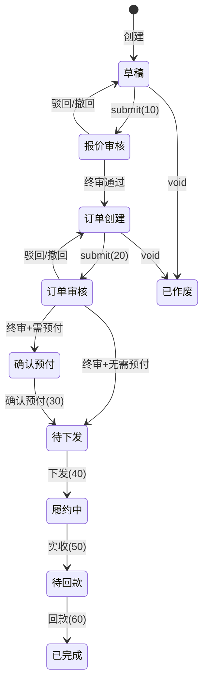

# 分销订单审批流引擎

> 源码：`distribution_order_workflow_engine.py`  
> 方案背景：见 [design.md](./design.md) §4.4 / §5.1 / §5.2

## 1. 定位

审批流引擎负责分销订单在**报价审核**、**订单审核**及**履约阶段**的状态迁移、日志写入与进度查询。

设计原则（与合同审批引擎对齐）：

| 原则 | 说明 |
|------|------|
| 配置驱动 | 环节定义在 `data_distribution_order_approval_config`，运行时**不建**审批实例表 |
| 主表定位 | `current_chain_code` + `current_step` 标识当前待审环节 |
| 日志审计 | 每次合法迁移写一条 `data_distribution_order_status_log` |
| 双链独立 | 定价链（chain=1）与订单链（chain=2/3）**互不共用**环节配置与时间轴 |

引擎**不 commit**；由 view 层调用后统一 `commit` / `rollback`。

---

## 2. 主状态与审批链

### 2.1 主状态（`order.status`）

| 值 | 常量 | 含义 |
|----|------|------|
| 10 | `STATUS_DRAFT` | 草稿 |
| 20 | `STATUS_QUOTE_REVIEW` | 报价审核 |
| 30 | `STATUS_ORDER_CREATE` | 订单创建 |
| 40 | `STATUS_ORDER_REVIEW` | 订单审核 |
| 50 | `STATUS_PREPAY` | 确认预付 |
| 60 | `STATUS_PENDING_DISPATCH` | 待下发 |
| 70 | `STATUS_FULFILLING` | 履约中 |
| 80 | `STATUS_PENDING_PAYMENT` | 待回款 |
| 90 | `STATUS_COMPLETED` | 已完成 |
| 99 | `STATUS_VOIDED` | 已作废 |

### 2.2 审批链（`chain_code`）

| 值 | 常量 | 用途 |
|----|------|------|
| 1 | `CHAIN_PRICING` | 定价审批（报价 submit 固定使用） |
| 2 | `CHAIN_ORDER_STANDARD` | 订单审批-标准（&lt;5000 USD） |
| 3 | `CHAIN_ORDER_TH_LARGE` | 订单审批-大额（≥5000 USD，TH 等场景） |
| 4 | `CHAIN_ORDER_LARGE` | 订单审批-大额（备用编码） |

订单链合法集合：`ORDER_CHAIN_CODES = (2, 3, 4)`。

### 2.3 阶段划分（`phase`）

| phase | 动作码范围 | 说明 |
|-------|-----------|------|
| `quote` | 10–14 | 报价审核 |
| `order` | 20–24 | 订单审核 |
| `fulfillment` | 30, 40, 50, 60 | 预付 / 下发 / 实收 / 回款 |

---

## 3. 动作码

### 3.1 报价审核

| 码 | 常量 | 说明 |
|----|------|------|
| 10 | `ACTION_QUOTE_SUBMIT` | 提交报价审核 |
| 11 | `ACTION_QUOTE_APPROVE` | 报价审核通过 |
| 12 | `ACTION_QUOTE_REJECT` | 报价审核驳回 |
| 13 | `ACTION_QUOTE_WITHDRAW` | 撤回报价审核 |
| 14 | `ACTION_QUOTE_AUTO_PASS` | 同人跳过自动通过（系统写入） |

### 3.2 订单审核

| 码 | 常量 | 说明 |
|----|------|------|
| 20 | `ACTION_ORDER_SUBMIT` | 提交订单审核 |
| 21 | `ACTION_ORDER_APPROVE` | 订单审核通过 |
| 22 | `ACTION_ORDER_REJECT` | 订单审核驳回 |
| 23 | `ACTION_ORDER_WITHDRAW` | 撤回订单审核 |
| 24 | `ACTION_ORDER_AUTO_PASS` | 同人跳过自动通过（系统写入） |

### 3.3 履约 / 其他

| 码 | 常量 | 说明 |
|----|------|------|
| 30 | `ACTION_PREPAY_CONFIRM` | 确认预付 |
| 40 | `ACTION_DISPATCH` | 下发千易 |
| 50 | `ACTION_RECEIVE_CONFIRM` | 确认实收 |
| 60 | `ACTION_PAYMENT_CONFIRM` | 确认回款 |
| 90 | `ACTION_VOID` | 作废 |

### 3.4 状态机约束（`_assert_transition`）

```
草稿(10)           --提交报价-->  报价审核(20)
报价审核(20)       --通过/驳回/撤回-->
订单创建(30)       --提交订单-->  订单审核(40)
订单审核(40)       --通过/驳回/撤回-->
确认预付(50)       --确认预付-->  待下发(60)
待下发(60)         --下发-->      履约中(70)
履约中(70)         --实收-->      待回款(80)
待回款(80)         --回款-->      已完成(90)
```

非法状态 × 动作组合会 `raise ValueError`。

---

## 4. 审批环节配置

表：`data_distribution_order_approval_config`

| 字段 | 说明 |
|------|------|
| `chain_code` | 所属审批链 |
| `step_no` | 环节序号，同链内唯一，从 1 递增 |
| `approver_type` | `1`=直线上级，`2`=办事角色 |
| `role_id` | 办事角色 ID（`approver_type=2` 时有效） |
| `role_name` | 环节展示名快照 |

### 4.1 审批人类型

**直线上级（`APPROVER_TYPE_LINE_MANAGER = 1`）**

- 定价链读 `order.quote_lm_user_id`
- 订单链读 `order.order_lm_user_id`
- 未填对应 `lm_user_id` 时，该环节**不参与**有效审批链（`should_include_approval_step` 返回 False）

**办事角色（`APPROVER_TYPE_ROLE = 2`）**

- 按客户国家 `customer_nation` + `chain_code` + `step_no` 查 `user_business_role_permission`
- 同一环节可有多个办事人（任一可审）
- 未配置审批人时该环节不可解析，跳过链式推进

### 4.2 典型环节示例

| chain | step | type | 角色名 |
|-------|------|------|--------|
| 1 | 1–3 | 办事角色 | 定价审批人-1/2/3 |
| 2 | 1 | 直线上级 | 直线上级 |
| 2 | 2 | 办事角色 | 分销主管 |
| 3 | 1 | 直线上级 | 直线上级 |
| 3 | 2 | 办事角色 | 分销主管 |
| 3 | 3 | 办事角色 | CEO |

---

## 5. 主表审批字段

| 字段 | 说明 |
|------|------|
| `current_chain_code` | 当前审批链；仅 status∈{20,40} 时有值 |
| `current_step` | 当前待审 `step_no`；与 chain 成对维护 |
| `quote_lm_user_id` | 报价链直线上级 |
| `order_lm_user_id` | 订单链直线上级 |
| `submit_by` | 本轮提交审核的操作人（submit 时写入） |
| `create_by` | 订单创建人（仅用于提交前预览，不计入运行时跳过） |

**终审通过后**：`current_chain_code`、`current_step` 置 `NULL`。

| 阶段 | 通过后目标状态 |
|------|----------------|
| 报价审核终审 | `STATUS_ORDER_CREATE` (30) |
| 订单审核终审 + 需预付 | `STATUS_PREPAY` (50) |
| 订单审核终审 + 无需预付 | `STATUS_PENDING_DISPATCH` (60) |

---

## 6. 核心入口

### 6.1 `apply_transition`

```python
order, meta, message = await apply_transition(
    session,
    order_id=...,
    action=ACTION_ORDER_APPROVE,
    operator_id=user_id,
    operator_role=OPERATOR_APPROVER,
    chain_code=None,           # 仅 order/submit 必填
    reject_to_step=None,       # 驳回到指定环节
    reject_to_status=None,     # 驳回到指定状态
)
```

返回值：

- `order`：已修改的 ORM 对象（未 flush/commit）
- `meta`：动作、阶段、前后状态、当前链/步等
- `message`：面向用户的简短文案

内部流程：

1. `_assert_transition` 校验状态 × 动作
2. 履约动作走 `_apply_fulfillment_transition`（不加载审批链）
3. 审批动作加载 `steps_raw`，按动作分支更新主表
4. 写主操作 `status_log`
5. 若有同人跳过，追加 `ACTION_*_AUTO_PASS` 日志
6. `refresh_order_tags` 刷新标签

### 6.2 `void_order`

草稿 / 订单创建 → 已作废；记录 `void_from_status`。

### 6.3 进度查询

| 函数 | 用途 |
|------|------|
| `load_quote_workflow_bundle` | 报价链 history + next（chain=1） |
| `load_order_workflow_bundle` | 订单链 history + next（chain 从主表或最近 submit log 解析） |

---

## 7. 同人跳过（核心规则）

> **规则**：本轮中，任意已执行过**提交**或**通过**的用户，若出现在后续环节的审批人集合中，则该环节**自动通过**，不再要求其重复操作。

### 7.1 已操作用户集合（`acted`）

| 来源 | 计入时机 |
|------|----------|
| 提交人 | submit 的 `operator_id` / `submit_by` / submit 日志 `operator_id` |
| 审批人 | 本轮各 approve 日志的 `operator_id` |
| 当前操作人 | approve 时尚未写日志，显式 `_add_operated_user_id(acted, operator_id)` |
| 自动通过 | 仅日志中的**触发跳过人** `operator_id`（不含同环节其他审批人） |

**链式推进**：跳过后只把**触发跳过的那个人**加入 `acted`，不会把该环节全部审批人一并计入。

收集函数：

- `chain_skip_acted_base_user_ids(order)` — 本轮 submit 操作人
- `collect_chain_acted_user_ids(session, order, chain_code, phase)` — 本轮完整已操作集合
- `initiator_acted_user_ids(order)` — **仅提交前预览**用（`create_by`），不参与运行时 approve 跳过

### 7.2 推进算法（`resolve_forward_with_skip`）

从 `after_step_no` 之后，按 `step_no` 升序扫描有效环节：

```
for 每个后续环节:
    approver_ids = 该环节全部可审批人
    if approver_ids 为空: continue
    if acted ∩ approver_ids ≠ ∅:
        记入 auto_pass_steps（触发人优先取本次操作人）
        acted.add(触发跳过的 user_id)    # 仅此人，非整步审批人
        continue
    return 下一待人工环节, auto_pass_steps
return None, auto_pass_steps     # 全部跳过 → 终审
```

**角色环节语义**：办事角色环节为「多人中任一可审」；只要 `acted` 中有一人落在该环节审批人集合内，整步跳过。

### 7.3 典型场景

```
发起人 A → 直线上级 B → 分销主管 {C,D} → CEO {C,E}

1. A 提交        → acted={A}，停在直线上级 B
2. B 通过        → acted={A,B}，分销主管不含 A/B，**不跳过**
3. C 通过分销主管 → acted 含 C，CEO 含 C → **仅 C 触发** CEO 自动通过
```

```
环节1: 直线上级 A
环节2: 分销审批人 {B}
环节3: CEO {A}

1. B 提交        → 停在环节1
2. A 通过        → 环节2 自动跳过（若 B∈acted），环节3 含 A → 再自动跳过 → 终审
```

### 7.4 自动通过日志（`_write_auto_pass_logs`）

每个被跳过环节写一条 `status_log`：

| 字段 | 值 |
|------|-----|
| `action_code` | 14（报价）/ 24（订单）→ 前端展示 `action_code_str` = **自动通过** |
| `operator_id` | 触发跳过的已操作用户（如提交人沈佳华） |
| `operator_role` | `OPERATOR_APPROVER` (2) |
| `role_name` | 被跳过环节角色名快照（如 `分销主管`） |
| `remark` | **不写**（NULL） |
| `from_step` / `to_step` | 被跳过环节 → 下一环节或 NULL |

前端展示示例：`分销主管` + `沈佳华` + `自动通过` 标签（字段 `role_name` / `operator_role_str`、`operator_name`、`action_code_str`）。

---

## 8. 提交 / 通过 / 驳回 / 撤回

### 8.1 提交（`ACTION_*_SUBMIT`）

1. `status` → 报价审核(20) 或 订单审核(40)
2. `current_chain_code` ← 活跃链；`submit_by` ← `operator_id`
3. 重置待办同步标记（`quote_approval_todo_synced_step` / `order_approval_todo_synced_step`）
4. `resolve_forward_with_skip(..., after_step_no=0)` 定位首个待人工环节
5. 若无可审环节 → 直接 `_finish_review_approval`

### 8.2 通过（`ACTION_*_APPROVE`）

1. 校验 `current_step` 非空
2. `collect_chain_acted_user_ids` + 当前操作人
3. `resolve_forward_with_skip(..., after_step_no=current_step)`
4. 有下一环节 → 更新 `current_step`；无 → 终审

### 8.3 驳回（`ACTION_*_REJECT`）

- 默认：回到草稿(10) / 订单创建(30)，清空 chain/step
- 指定 `reject_to_step` / `reject_to_status`：回退到链内某环节或中间状态（**不清业务数据**，Q2）
- 离开审核态时 `current_chain_code` 置 NULL

### 8.4 撤回（`ACTION_*_WITHDRAW`）

提交人撤回：回到草稿 / 订单创建，清空 chain/step。

---

## 9. 权限校验

| 函数 | 用途 |
|------|------|
| `user_can_review_at_step` | 指定用户是否可审指定环节 |
| `user_can_review_order` | 是否可审当前主表环节 |
| `assert_chain_has_approvers` | 提交前校验链上办事角色已配置 |

直线上级： `user_id == lm_user_id`  
办事角色： `_get_user_valid_role_step` 有结果

---

## 10. 审批流 Bundle（前端展示）

### 10.1 响应结构

```json
{
  "order_sn": "...",
  "order_status": 40,
  "order_status_str": "订单审核",
  "current_chain_code": 2,
  "current_step": 1,
  "phase": "order",
  "history_steps": [ ... ],
  "next_steps": [ ... ]
}
```

### 10.2 `history_steps`

按 `create_time`、`_id` 升序合并：

- 人工动作日志（submit/approve/reject/withdraw）
- 自动通过日志（auto_pass）

### 10.3 `next_steps`

| 订单状态 | 展示逻辑 |
|----------|----------|
| 草稿 / 订单创建（未进审核） | 发起人「办理中」+ 全链环节预览（用 `create_by` 估算跳过） |
| 审核中 | 从 `current_step` 起：首项「办理中」，其余「待办理」或「自动通过」 |
| 审核已结束 | 空列表 |

**同人跳过预览**与运行时共用 `_list_active_steps_after` + 相同 `acted` 规则：仅触发跳过的实际操作人计入 `acted`；自动通过项展示该人 `operator_name` 与 `operator_id`。

`action_code_str` 取值：`办理中` / `待办理` / `自动通过`

---

## 11. 状态日志规范

表：`data_distribution_order_status_log`

| 场景 | `from_chain` / `to_chain` | `from_step` / `to_step` | `role_name` |
|------|---------------------------|-------------------------|-------------|
| 提交进入审核 | NULL → chain | NULL → 首步或跳过后的步 | `to_step` 对应角色名 |
| 环节通过 | chain → chain | from_step → to_step | `from_step` 角色名 |
| 终审通过 | chain → NULL | step → NULL | `from_step` 角色名 |
| 自动通过 | chain → chain | 跳过步 → 下一步 | 跳过步角色名 |

`trigger_type`：审批相关一般为 `TRIGGER_APPROVAL` (3)。

---

## 12. 模块函数索引

### 12.1 对外常用

| 函数 | 说明 |
|------|------|
| `apply_transition` | 执行状态迁移（主入口） |
| `void_order` | 作废 |
| `load_quote_workflow_bundle` | 报价审批流查询 |
| `load_order_workflow_bundle` | 订单审批流查询 |
| `user_can_review_order` | 当前用户可否审批 |
| `assert_chain_has_approvers` | 提交前审批人配置校验 |
| `get_customer_country` | 解析客户国家 |
| `phase_for_action` | 动作码 → 阶段 |

### 12.2 内部关键

| 函数 | 说明 |
|------|------|
| `_load_approval_steps` | 按 chain 加载配置 |
| `effective_approval_steps` | 过滤无效环节后的有效链 |
| `get_step_approver_user_ids` | 解析单环节全部审批人 |
| `collect_chain_acted_user_ids` | 本轮已操作用户 |
| `resolve_forward_with_skip` | 同人跳过推进 |
| `_finish_review_approval` | 终审通过收尾 |
| `_write_status_log` / `_write_auto_pass_logs` | 写日志 |

---

## 13. 流程图

### 13.1 整体生命周期



### 13.2 同人跳过推进

```mermaid
flowchart TD
    A[提交或通过] --> B[收集 acted 已操作用户]
    B --> C[从当前 step 向后扫描]
    C --> D{后续环节审批人 ∩ acted ?}
    D -->|非空| E[记入 auto_pass_steps<br/>acted |= 审批人]
    E --> C
    D -->|为空| F[停在该环节待人工审批]
    C -->|无更多环节| G[终审通过]
    E --> H[写 AUTO_PASS 日志]
    F --> I[更新 current_step]
    G --> J[清空 chain/step<br/>更新 status]
```

---

## 14. 与 design.md 的关系

| 主题 | design.md | 本文档 |
|------|-----------|--------|
| 表结构 / API 路径 | §4、§5 | 引用，不重复 DDL |
| 引擎行为 / 跳过规则 | 分散 | **本文档集中说明** |
| 待确认问题 | §8 | 以实现代码为准 |

后续引擎行为变更请同步更新本文档。
